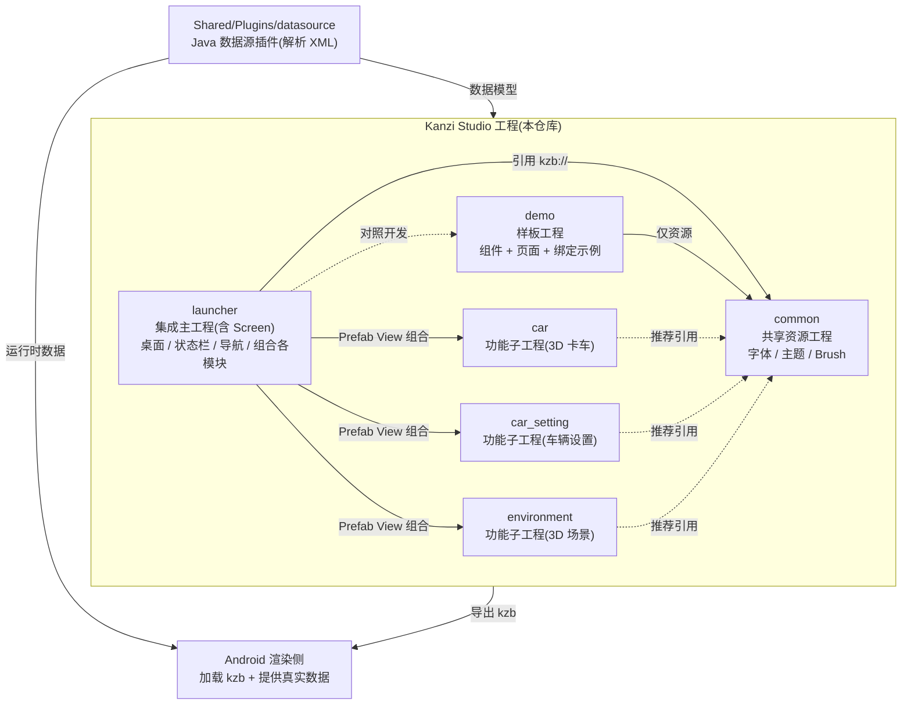

# IVI — Kanzi 中控 HMI 工程

本仓库是基于 **Kanzi Studio** 开发的车机中控(IVI / 中控)HMI 工程。采用**多工程模块化**:一个集成主工程(`launcher`)+ 一个共享资源工程(`common`)+ 若干功能子工程(`car` / `car_setting` / `environment` …),数据由一个 **Java 数据源插件**(解析 XML)注入,UI 通过绑定读写。产物为各工程导出的 **kzb**,交给 Android 渲染侧加载。

> 本套文档的目标:**让团队成员照着这里的结构与示例,独立开发出完整的中控应用。**
>
> **当前开发重点**: `car` 3D 模型分组与可控性;**demo 暂停**,文档保留作样板参考。

## 架构总览

## 仓库结构

> 目录分层的完整说明(调整背景、每条调整的理由与收益)见 [docs/repo-structure.md](docs/repo-structure.md)。

| 路径 | 角色 | 说明 |
|------|------|------|
| `CMakeLists.txt` | **根构建入口** | `cmake -S . -B build` 即可;等价于 `IVI/launcher/Application` 下的 bat |
| `IVI/` | **Kanzi 构建工作区** | 全部 Kanzi 工程 + 运行时资源,Studio 侧只需关心这一个目录 |
| `IVI/assets/` | **运行时/导出目录** | kzb 导出目标 + VS 调试工作目录;含 `datasource.xml`(**数据契约**单一来源)、`application.cfg`;`Localization/`、`lz4/`、`pc_exe/` 为预留 |
| `IVI/launcher/` | **集成主工程** | 含 `Tool_project/launcher.kzproj` 与 `Application/`(C++);持有 Screen,组合各模块,运行时入口 |
| `IVI/common/` | **共享资源工程** | `common.kzproj` + 字体 / Color Brush / AppTheme / Named Style(**不含 UI 组件**) |
| `IVI/demo/` | **样板工程** | `demo.kzproj` — Card 等组件、DemoPage、绑定示例;照着做,非运行时依赖 |
| `IVI/car/` | 功能子工程 | 3D 卡车(`3D Assets/`、`MeshData/`、`Shaders/`) |
| `IVI/car_setting/` | 功能子工程 | 车辆设置(纯 2D UI) |
| `IVI/environment/` | 功能子工程 | 3D 场景 / 光照贴图 |
| `Shared/Plugins/` | **业务 Kanzi 插件** | `DroidDataSourceplugin.jar`;系统插件(`kzjvm` 等)用 Kanzi 安装目录,见 [`Shared/Plugins/README.md`](Shared/Plugins/README.md) |
| `Shared/Resources/` | 跨模块原始资源 | `carmodel/`(车型变体)、`ota/`(热更新)预留,见 [`Shared/Resources/README.md`](Shared/Resources/README.md) |
| `BuildConfigs/` | 构建变体配置 | 预留,见 [`BuildConfigs/README.md`](BuildConfigs/README.md) |
| `Android/` | Android 渲染侧 | 预留,见 [`Android/README.md`](Android/README.md) |
| `scripts/` | 自动化脚本 | 模型分组(`group_car_model.py`)、文档上传 Confluence |
| `docs/` | 文档 | 架构、规范、操作手册、PlantUML 图源 |

> 子工程**不要求**完整目录结构,按需即可(只有 `launcher` 带 `Application/`)。

## 文档索引

- [仓库目录结构:分层设计与调整说明](docs/repo-structure.md)
- [Windows 桌面 VS 运行 / Java 插件崩溃排查](docs/windows-desktop-run.md)
- [CMake 构建体系详解 + F5/Ctrl+F5 差异原因(0xC0000005)](docs/cmake-build-and-run.md)
- [架构总览与设计原则](docs/architecture.md)
- [Kanzi Studio 中控项目标准架构(官方文档对照:脑暴图/架构图/时序图/标准文件结构/差距分析)](docs/kanzi-standard-architecture.md)
- [命名规范(单页执行版)](docs/naming-conventions.md)
- [数据接收与发送节点(Data In/Out 全通道)](docs/data-io-nodes.md)
- [状态机总纲 + 5 个状态机规格](docs/state-machines/README.md):[充电](docs/state-machines/sm-charging.md) / [驾驶模式](docs/state-machines/sm-drive-mode.md) / [底盘](docs/state-machines/sm-chassis.md) / [轮胎](docs/state-machines/sm-tires.md) / [空调](docs/state-machines/sm-hvac.md)
- [Trigger 指南(触发器/条件/动作)](docs/trigger-guide.md)
- [car 3D 模型分组（轮胎 / 车门）](docs/car-model-grouping.md) ⭐ **当前**
- [3D 摄像头：视角状态机与手势旋转（CameraView + ResetCameraRotation）](docs/architecture/camera-view-and-gesture.md)
- [数据源:插件 + XML 契约 + 绑定(读/写)](docs/data-source.md)
- [demo 一站式搭建文档](docs/demo-build-all.md)（暂停维护,样板参考）
- [Kanzi Studio 操作手册(手把手,含 common 建哪些资源)](docs/kanzi-studio-guide.md)
- [demo 定义清单(颜色/主题/组件/属性的具体设定值)](docs/demo-spec.md)
- [如何新增一个模块(照着做)](docs/add-new-module.md)
- [demo 样板模块 — 开发示例大全](docs/demo-module.md)
- [命名 / 引用 / Public 可见性 / 导出规范](docs/conventions.md)
- [本地化(中英)与主题(日/夜)](docs/localization-and-theme.md)
- [导出 kzb 与依赖关系](docs/export-kzb.md)
- [组件从 common 迁到 demo（Studio 操作）](docs/migrate-components-to-demo.md)
- 架构图源文件(PlantUML):[`docs/diagrams/`](docs/diagrams/)

## 快速上手(开发一个新模块)

1. 读 [架构总览](docs/architecture.md) 和 [命名/引用规范](docs/conventions.md)。
2. 在 `IVI/` 下新建 `<module>/<module>.kzproj`,**引用 `common`**(字体/主题/Brush)。
3. 参照 **demo** 的组件与绑定写法,在**本模块**建自己的 Prefab;属性**绑定到数据源**(见 [data-source](docs/data-source.md))。
4. 文案走**本地化**、样式走**主题 token**(见 [localization-and-theme](docs/localization-and-theme.md))。
5. 在 `launcher` 里用 **Prefab View** 把模块挂上、加导航。
6. 导出各自 kzb(见 [export-kzb](docs/export-kzb.md))。

详细步骤见 [docs/add-new-module.md](docs/add-new-module.md)。

## 工程约束(重要)

- 大二进制走 **Git LFS**(见 `.gitattributes`):png/dds/otf/glb/jar/MeshData 等。
- 自动生成/本地文件不入库(见 `.gitignore`):autosave、`*.kzproj_*` 备份、`.lock`、`Temp/`、图片缓存、kzb 导出产物。
- 提交前请在 Kanzi Studio 中 **Save**;关闭 Studio 后再做 `git reset/pull`(否则插件 jar 等会被占用)。
