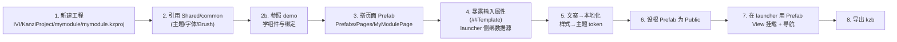

# 如何新增一个模块(照着做)

本文是"照着例子开发"的核心。以新增一个功能模块 `mymodule` 为例,从建工程到接入 launcher、导出 kzb 全流程。

> 前置阅读:[架构总览](architecture.md)、[命名/引用规范](conventions.md)、[数据源](data-source.md)、[本地化与主题](localization-and-theme.md)。

## 流程总览

## 步骤详解

### 1. 新建工程

- Kanzi Studio `New Project`,工程名 **全小写** `mymodule`,保存到 `IVI/KanziProject/mymodule/`(子工程**不需要**完整目录,有 `mymodule.kzproj` + 资源目录即可)。
- 
- 导出路径建议设到独立目录(见 [export-kzb.md](export-kzb.md))。

### 2. 引用 common

- `Library > Project References` → **Add Existing Project** → 选 `IVI/KanziProject/Shared/common/v101_sedan/common.kzproj`。
- 之后即可使用 common 的字体、主题 token、Color Brush。**UI 组件不在 common** — 打开 `IVI/KanziProject/demo/demo.kzproj` 对照 Card / LabelText 等做法,在**本模块**建自己的 Prefab。

### 3. 搭页面 Prefab

- 建 `Prefabs/Pages/MyModulePage` 作为模块**根 Prefab**(命名稳定,供 launcher 挂载)。
- 用本模块的 Prefab 拼 UI(结构可参照 demo,路径为 `kzb://mymodule/...`)。

### 4. 接数据(数据源在 launcher,不在模块)

数据源插件在 **launcher**,模块设计期看不到数据源。所以用**属性下发**模式(见 [data-source.md §3.5](data-source.md)):

- **模块侧**:在根 Prefab 暴露输入属性(如 `MyModule.Soc`、`MyModule.ToggleOn`),内部节点绑定 `{##Template/MyModule.Soc}`;给属性设计期默认值便于独立预览。
- **launcher 侧**:在挂载本模块的 Prefab View 上,把这些属性**读绑定**到数据源字段,写用 **To-Source** 回推(或用 Message)。
- 处理好 `<signal>Valid` 故障态。

### 5. 文案与样式

- 文案:走**本地化**(中英),禁止硬编码文字。
- 样式:颜色/字号/圆角引用 **主题 token**(common 的 Resource Dictionary),禁止写死。
- 详见 [localization-and-theme.md](localization-and-theme.md)。

### 6. 暴露给 launcher(Public)

- 选中 `MyModulePage` 根 Prefab → Properties 设 **`Visibility Across Projects = Public`**(或右键 Make Public)。
- 如需被外部控制的属性,在根节点用自定义属性 + `##Template` 绑定暴露(见 [conventions.md](conventions.md))。

### 7. 在 launcher 中挂载 + 导航

- 打开 `launcher`,`Library > Project References` 引用 `IVI/mymodule/mymodule.kzproj`。
- 在内容区创建 **Prefab View** 节点,`Prefab Template` 指到 `kzb://mymodule/Prefabs/Pages/MyModulePage`。
- 把它接入 launcher 的**导航/状态机**(在桌面入口/标签切换时显示)。

### 8. 导出 kzb

- 先导 `common.kzb`,再导 `mymodule.kzb`(模块依赖 common)。
- 详见 [export-kzb.md](export-kzb.md)。

## 自检清单(交付前)

- [ ]  工程名全小写,保存在 `IVI/KanziProject/mymodule/`
- [ ]  已引用 common;样式走主题 token / LocaleStyle;UI 参照 demo 自建 Prefab
- [ ]  无硬编码文字(走本地化)、无硬编码颜色/字号(走 token)
- [ ]  数据读用普通绑定、写用 To-Source;处理了 `Valid` 故障态
- [ ]  根 Prefab `MyModulePage` 命名稳定且 `Public`
- [ ]  已在 launcher 用 Prefab View 挂载并接入导航
- [ ]  能独立导出 `mymodule.kzb`,运行时先加载 `common.kzb`
- [ ]  大资源走 LFS;无 autosave/缓存/Temp 入库

## 参考现有模块

- `car` / `environment`:含 3D 资源的模块写法(`3D Assets/`、`MeshData/`、`Shaders/`)。
- `car_setting`:纯 2D UI 模块写法(目前**待接入 launcher**,可作为"补全接入"的练习)。
