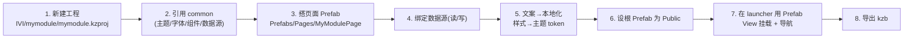

# 如何新增一个模块(照着做)

本文是"照着例子开发"的核心。以新增一个功能模块 `mymodule` 为例,从建工程到接入 launcher、导出 kzb 全流程。

> 前置阅读:[架构总览](architecture.md)、[命名/引用规范](conventions.md)、[数据源](data-source.md)、[本地化与主题](localization-and-theme.md)。

## 流程总览

## 步骤详解

### 1. 新建工程
- Kanzi Studio `New Project`,工程名 **全小写** `mymodule`,保存到 `IVI/mymodule/`(子工程**不需要**完整目录,有 `mymodule.kzproj` + 资源目录即可)。
- 导出路径建议设到独立目录(见 [export-kzb.md](export-kzb.md))。

### 2. 引用 common
- `Library > Project References` → **Add Existing Project** → 选 `IVI/common/common.kzproj`。
- 之后即可使用 common 的字体、主题 token、通用组件、数据源(它们在 common 里已设 `Public`)。

### 3. 搭页面 Prefab
- 建 `Prefabs/Pages/MyModulePage` 作为模块**根 Prefab**(命名稳定,供 launcher 挂载)。
- 用 **common 的通用组件**(Button/Card/Switch/List 等)拼 UI,不要重复造控件。

### 4. 绑定数据源
- 在页面根节点加 `Data Context` 指向 common 的数据源(子节点继承)。
- **读**:`Text/Value/Visible` 等属性 `+ Add Binding` 到对应字段。
- **写**(如开关/滑块):用 **To-Source** 绑定回写字段。
- 详见 [data-source.md](data-source.md)。处理好 `<signal>Valid` 故障态。

### 5. 文案与样式
- 文案:走**本地化**(中英),禁止硬编码文字。
- 样式:颜色/字号/圆角引用 **主题 token**(common 的 Resource Dictionary),禁止写死。
- 详见 [localization-and-theme.md](localization-and-theme.md)。

### 6. 暴露给 launcher(Public)
- 选中 `MyModulePage` 根 Prefab → Properties 设 **`Visibility Across Projects = Public`**(或右键 Make Public)。
- 如需被外部控制的属性,在根节点用自定义属性 + `##Template` 绑定暴露(见 [conventions.md](conventions.md))。

### 7. 在 launcher 中挂载 + 导航
- 打开 `launcher`,`Library > Project References` 引用 `IVI/mymodule/mymodule.kzproj`。
- 在内容区创建 **Prefab View** 节点,`Prefab Template` 指到 `kzb://mymodule/Prefabs/Pages/MyModulePage`。
- 把它接入 launcher 的**导航/状态机**(在桌面入口/标签切换时显示)。

### 8. 导出 kzb
- 先导 `common.kzb`,再导 `mymodule.kzb`(模块依赖 common)。
- 详见 [export-kzb.md](export-kzb.md)。

## 自检清单(交付前)

- [ ] 工程名全小写,保存在 `IVI/mymodule/`
- [ ] 已引用 common,UI 用的是 common 的组件/主题/字体
- [ ] 无硬编码文字(走本地化)、无硬编码颜色/字号(走 token)
- [ ] 数据读用普通绑定、写用 To-Source;处理了 `Valid` 故障态
- [ ] 根 Prefab `MyModulePage` 命名稳定且 `Public`
- [ ] 已在 launcher 用 Prefab View 挂载并接入导航
- [ ] 能独立导出 `mymodule.kzb`,运行时先加载 `common.kzb`
- [ ] 大资源走 LFS;无 autosave/缓存/Temp 入库

## 参考现有模块
- `car` / `environment`:含 3D 资源的模块写法(`3D Assets/`、`MeshData/`、`Shaders/`)。
- `car_setting`:纯 2D UI 模块写法(目前**待接入 launcher**,可作为"补全接入"的练习)。
