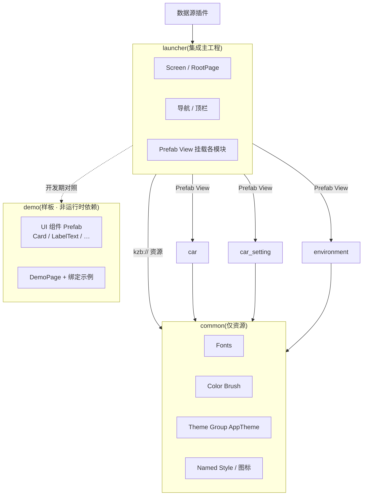
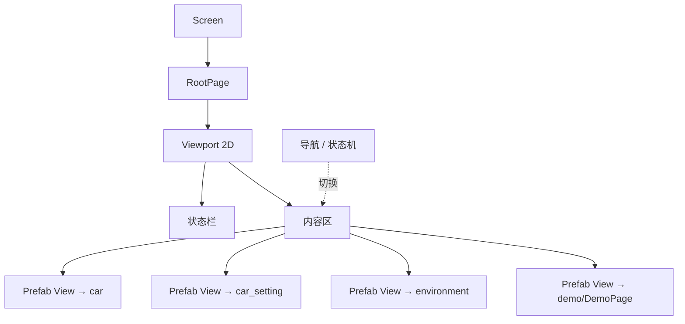
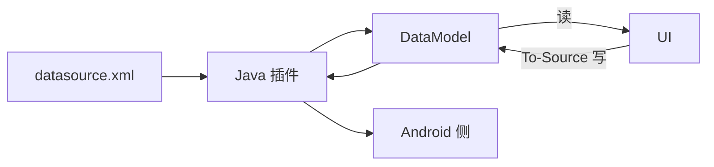

# 架构总览与设计原则

> **开发状态**: demo 样板工程**暂停**;当前优先 **car 3D 模型**（轮胎/车门分组与动画绑定）。详见 [car-model-grouping.md](car-model-grouping.md)。

## 1. 总体形态

IVI 中控 HMI 采用 **多工程模块化 + 多 kzb** 架构:

- **`launcher`** = 集成主工程,持有运行时 **Screen**,负责桌面/状态栏/导航,并把各功能模块**组合**进来。
- **`common`** = **共享资源工程**(仅资源):字体、Color Brush、Theme Group、Named Style 等。**不放 UI 组件 Prefab**。
- **`demo`** = **样板/reference 工程**（**当前暂停维护**）:完整 2D UI 示例;供团队对照学习,**不是**各模块的运行时依赖。
- **功能子工程**(`car` / `car_setting` / `environment` …)= 各自业务域,独立导出 kzb;引用 **common** 拿资源,参照 **demo** 学做法。
- **`Shared/Plugins/datasource`** = Java 数据源插件(**在 launcher 注册**),解析 `IVI/assets/datasource.xml`;数据源属 **Screen 级**,归 launcher。

每个 `.kzproj` 导出一个 **kzb**,由 Android 渲染侧加载。

## 2. 组件关系图

> **分工要点**: `common` = 设计 token 与素材; `demo` = 怎么搭 UI、怎么 expose、怎么绑定; 业务模块 = 自己的 Prefab + 引用 common 资源。

## 3. 设计原则(必须遵守)

1. **依赖单向、无环**:`launcher → 各模块`、`各模块 → common`;**common 不引用上层**;**模块之间不互相引用**;**业务模块不依赖 demo kzb**(demo 仅文档级样板)。
2. **common 只放资源**:主题 token、字体、Named Style、Brush。UI 控件 Prefab 放在**所属模块**或 **demo**(示例)。
3. **demo 是参考实现**:新同事先跟 [demo-build-all.md](demo-build-all.md) 在 demo 里走通全流程,再在自己的模块复刻模式。
4. **UI 与数据解耦**:绑定读写数据源;子模块经 launcher 的 `##Template` 属性接数据(见 [data-source.md](data-source.md))。
5. **文案走本地化、样式走主题**:禁止硬编码颜色/字号;颜色用 `Color/*` resource ID。
6. **launcher 只负责组合与导航**:用 Prefab View 挂模块根 Prefab,不硬连模块内部节点。

## 4. 运行时组合(launcher 如何把模块拼起来)

- 各模块以 **Prefab View** 挂 `kzb://<module>/Prefabs/...`。
- 模块根 Prefab 通过 **expose + `##Template`** 对外暴露属性;launcher 在 Prefab View 实例上绑定数据源。

## 5. 数据流(概念)

细节见 [data-source.md](data-source.md)。

## 6. 产物与交付

- 工程 kzb:`common.kzb`、`demo.kzb`、`launcher.kzb`、`car.kzb` …
- **运行时必须先加载 `common.kzb`**,再加载业务模块 kzb。
- `demo.kzb` 仅在 launcher 挂载 Demo 页时需要;其它业务模块不依赖 demo。
- 详见 [export-kzb.md](export-kzb.md)。

## 7. 历史遗留与迁移

若你本地 `common.kzproj` 里仍有 `Card` / `LabelText` 等 Prefab,属旧架构。本仓库主分支已迁到 demo;旧工程请按 [migrate-components-to-demo.md](migrate-components-to-demo.md) 对齐。

## 8. 架构图源文件

PlantUML 源在 [`docs/diagrams/`](diagrams/)。
