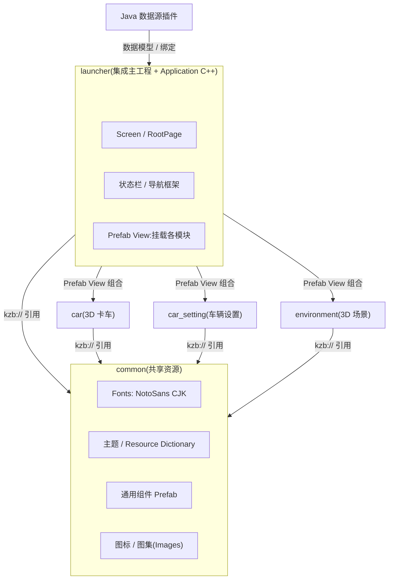
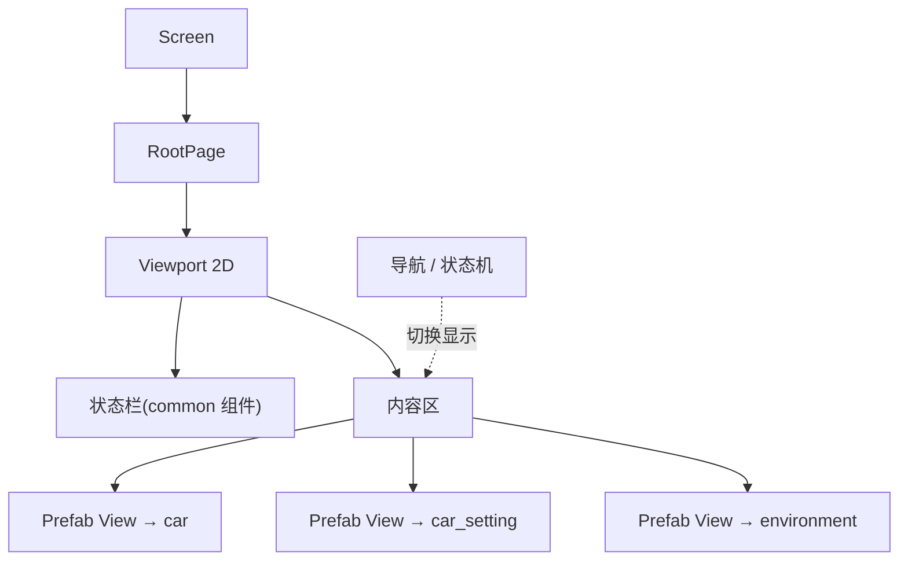
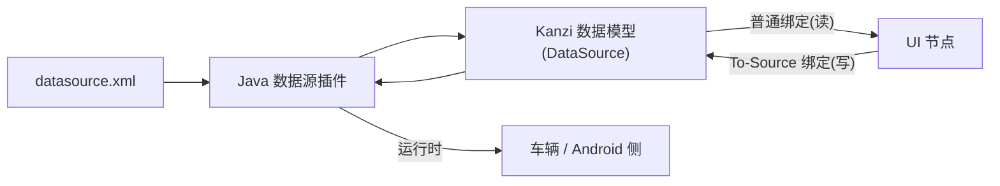

# 架构总览与设计原则

## 1. 总体形态

IVI 中控 HMI 采用 **多工程模块化 + 多 kzb** 架构:

- **`launcher`** = 集成主工程,持有运行时 **Screen**,负责桌面/状态栏/导航,并把各功能模块**组合**进来。
- **`common`** = 共享资源工程(设计系统地基):字体、主题、通用组件(**数据源不在此**,见下)。
- **功能子工程**(`car` / `car_setting` / `environment` …)= 各自一个业务域,独立导出 kzb。
- **`plugins/datasource`** = Java 数据源插件(**在 launcher 注册**),解析 `assets/datasource.xml` 把数据喂给数据模型;数据源属 **Screen 级**,归 launcher(子模块通过 `##Template` 属性从 launcher 接收数据)。

每个 `.kzproj` 导出一个 **kzb**,由 Android 渲染侧加载。

## 2. 组件关系图

> 现状提示:目前 `launcher` 已引用 `common/car/environment`;`car/car_setting/environment` 对 `common` 的引用**建议补齐**(把主题/字体/组件下沉 common、各模块引用,避免重复)。`car_setting` 还**未接入** launcher。

## 3. 设计原则(必须遵守)

1. **依赖单向、无环**:`launcher → 各模块`、`各模块 → common`;**common 不引用任何上层**,**模块之间不互相引用**。
2. **common 是共享地基**:主题 token、字体、通用组件在 common 定义,其它工程**引用**(标 `Public`)。**数据源不走 common**:插件在 launcher、数据源属 Screen 级,子模块经 launcher 用 `##Template` 属性接收数据(见 [data-source.md §3.5](data-source.md))。
3. **UI 与数据解耦**:UI 只通过**数据绑定**读写数据源,不在界面里硬编码业务数据。
4. **文案走本地化、样式走主题**:禁止硬编码文字与颜色/字号。
5. **launcher 只负责组合与导航**:不在主工程里硬连模块内部节点,模块通过 Prefab View / 运行时加载挂载。

## 4. 运行时组合(launcher 如何把模块拼起来)

- 各模块以 **Prefab View**(引用 `kzb://<module>/...` 的根 Prefab)挂在 launcher 的内容区。
- 通过 **Prefab 控制属性**(如 `##Template/<Namespace>.<Prop>`)由外部控制模块外观/状态。
- 切换显示由导航/状态机驱动。

## 5. 数据流(概念)

细节见 [data-source.md](data-source.md)。

## 6. 产物与交付

- 每个工程导出一个 kzb:`launcher.kzb / common.kzb / car.kzb / car_setting.kzb / environment.kzb`。
- 模块 kzb 通过 `kzb://common/...` 引用 common → **运行时加载模块前必须先加载 `common.kzb`**。
- 交给 Android 渲染侧加载。详见 [export-kzb.md](export-kzb.md)。

## 7. 架构图源文件

PlantUML 源在 [`docs/diagrams/`](diagrams/):

- `architecture-overview.puml` — 组件/工程关系
- `data-flow.puml` — 数据读写流
- `runtime-composition.puml` — 运行时节点组合
- `build-pipeline.puml` — 导出与交付流水线

> 渲染:用 PlantUML 插件 / `plantuml file.puml` / VS Code PlantUML 扩展。Markdown 内的 Mermaid 图在 GitHub 可直接显示。
