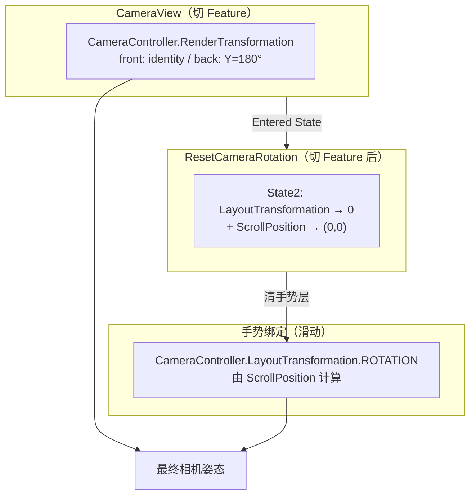
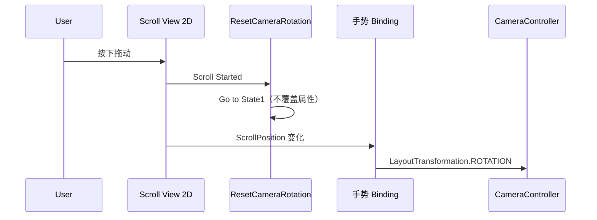
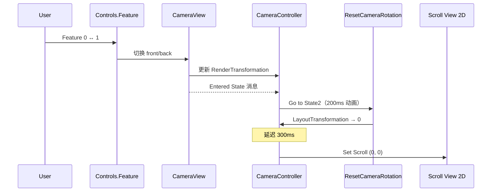

# 3D 摄像头：视角状态机与手势旋转

> launcher 中 **CameraView**（前/后视切换）与 **Scroll View 手势旋转** 的协作说明。  
> 目标：切换 Feature 时回到预设视角，滑动时不丢跟手，两者互不覆盖。  
> 官方依据：[Car Template — Template structure / ResetCameraRotation](https://docs.kanzi.com/project-templates/3.9.10/car/car-structure.html#resetcamerarotation)

## 1. 问题背景

3D 车模场景需要同时支持：

| 能力 | 期望行为 |
|------|----------|
| **视角切换** | `front` / `back`（或其它 Feature）切到各自预设机位 |
| **手势旋转** | 手指左右/上下滑，相机绕车旋转、俯仰 |

若两者都写进**同一个变换属性的同一字段**（例如都只改 `Camera.LayoutTransformation.ROTATION`），会出现：

- 切状态时带着手势累积角度，看起来像「在当前姿态上再转 180°」
- 状态机动画与绑定每帧抢写同一属性，切换后回不到预设位

本工程采用 **属性分工 + ResetCameraRotation** 解决上述冲突。

---

## 2. 节点结构（launcher）

路径：`RootPage > Scroll View 2D > Viewport 2D > Scene > …`

```
Scene
└── CameraRoot                         ← State Manager: ResetCameraRotation
    └── CameraController               ← State Manager: CameraView
        │                              ← Binding: Scroll → LayoutTransformation.ROTATION
        └── Camera                     ← 固定基础机位 (translation 0, 4.7, 15)
```

| 节点 | 职责 |
|------|------|
| **CameraRoot** | 挂 `ResetCameraRotation`；切 Feature 时把手势旋转清零 |
| **CameraController** | 挂 `CameraView`；接收滑动手势绑定；`Feature` 由 `Controls/Feature` 驱动 |
| **Camera** | 实际 Camera 节点；保存前视默认偏移，不作为手势绑定目标 |

> **为何多一层 CameraRoot？**  
> 与官方模板类似：`CameraView` 管「看哪里」，`ResetCameraRotation` 管「忘掉滑了多少」。分层后 State Object 可分别指向子节点属性，逻辑更清晰。官方把 Reset 直接挂在 `CameraController` 上亦可，本质相同。

---

## 3. 两个状态机 + 一条绑定

### 3.1 CameraView — 预设视角（离散）

| 项 | 配置 |
|----|------|
| 挂载节点 | `CameraController` |
| State Group 控制属性 | `Feature`（Int） |
| 数据来源 | `Controls/Feature`（OneWay 绑定） |
| 状态示例 | `front` = 0，`back` = 1 |

**本工程当前快照（可随美术调整）：**

| 状态 | 目标 | 属性 | 值 |
|------|------|------|-----|
| `front` | `CameraController` (`.`) | `RenderTransformation` | identity |
| `back` | `CameraController` (`.`) | `RenderTransformation` | rotation Y = **180°** |

> **说明**：当前 back 用 **Y 轴翻转**近似后视。若产品需要真实「绕到车后」机位，应在 State Tools 中改为记录 **`Camera` 的 `LayoutTransformation`（含 Translation）**，用 Preview Camera 工具分别摆好前/后视再存状态。

过渡：State Group 默认 **500ms CUBIC** 动画。

### 3.2 手势绑定 — 连续旋转（滑动）

| 项 | 配置 |
|----|------|
| 挂载节点 | `CameraController`（Binding 作为其子项） |
| 目标属性 | `LayoutTransformation` → **ROTATION** |
| 数据源 | `Scroll View 2D` 的 `ScrollPosition` |

**绑定表达式（当前启用）：**

```kanzi
pixelsPerRevolution = 3000.0
pixelsPerDegree     = pixelsPerRevolution / 360.0
scrollX  = {@Scroll View 2D/ScrollViewConcept.ScrollPosition}.x
degreesX = mod(mod(scrollX, pixelsPerRevolution) + pixelsPerRevolution, pixelsPerRevolution) / pixelsPerDegree
scrollY  = {@Scroll View 2D/ScrollViewConcept.ScrollPosition}.y
degreesY = scrollY / pixelsPerDegree
degreesY = clamp(-45, 15, degreesY)
createRotation(degreesY, degreesX, 0)
```

特点：

- 水平：`scrollX` 每 3000px 转一圈（0°～360° 循环）
- 垂直：`degreesY` 限制在 -45°～15°（俯仰）
- **不必**使用官方 MOD/STEP 公式；该公式仅用于把水平角折返到 ±180°，过渡更顺，属可选优化

### 3.3 ResetCameraRotation — 切视角时清手势

| 项 | 配置 |
|----|------|
| 挂载节点 | `CameraRoot` |
| State2 作用对象 | 子节点 `CameraController` 的 `LayoutTransformation` |

| 状态 | 行为 |
|------|------|
| **State1** | 不覆盖任何属性 → 滑动时由绑定驱动 `LayoutTransformation.ROTATION` |
| **State2** | `CameraController.LayoutTransformation` 全部归零（rotation 0，translation 0，scale 1） |

过渡：进入 State2 时 **200ms SINE** 动画回正。

---

## 4. 为何互不干扰：属性分工

Kanzi 属性优先级（简化）：**State Manager 覆盖 > Binding > 本地默认值**。

本工程把两类变换拆开：



| 操作 | RenderTransformation | LayoutTransformation.ROTATION |
|------|---------------------|------------------------------|
| 滑动 | 不变（保持 front/back 预设） | 绑定实时更新 |
| 切 front/back | CameraView 动画切换 | Entered State → State2 归零 |
| 切完后 | 已是新视角预设 | 0（与 ScrollPosition=0 一致） |

**关键**：手势只写 `LayoutTransformation`，视角预设只写 `RenderTransformation`，Reset 只清 `LayoutTransformation`，因此不会互相覆盖。

---

## 5. 触发器时序

### 5.1 用户滑动（Feature 不变）



| 触发器 | 节点 | 动作 |
|--------|------|------|
| `Scroll View: Scroll Started` | `Scroll View 2D` | `Go to State` → `ResetCameraRotation` / **State1**（Target: `CameraRoot`） |

### 5.2 用户切换 front / back（Feature 变化）



| 触发器 | 节点 | 动作链 |
|--------|------|--------|
| `State Manager: Entered State` | **`CameraController`** | ① `Go to State` → `ResetCameraRotation` / **State2**（Target: `CameraRoot`）<br/>② Delay **300ms** → `Scroll View: Set Scroll` → `ScrollPosition (0, 0)` |

> **为何 Entered State 挂在 CameraController？**  
> 因为 `CameraView` 挂在此节点；状态进入消息从本节点发出。官方模板把 `CameraView` 挂在 `Viewport 2D`，故官方把 Entered State 挂在 `Viewport 2D` —— **触发器应挂在持有 CameraView 的节点上**。

> **为何延迟 300ms？**  
> State2 动画约 200ms。若立刻清零 `ScrollPosition`，绑定会马上写出非零旋转，与正在归零的 SM 冲突导致画面跳动。先动画回正，再清 scroll，两者对齐。

---

## 6. Studio 配置清单

按此清单可在其它页面或新项目中复现。

### 6.1 创建状态机

1. **CameraView**（`CameraController`）
   - State Group 控制属性：`Feature`
   - 创建 `front` / `back`，分别录制 `RenderTransformation`（或按需改录 `Camera.LayoutTransformation`）
   - `CameraController.Feature` 绑定 `{@Controls/Feature}`

2. **ResetCameraRotation**（`CameraRoot`）
   - State1：空 State Object（不录属性），目标路径 `CameraController`
   - State2：目标 `CameraController`，录 `LayoutTransformation` 全零
   - State2 过渡：200ms

### 6.2 手势绑定

- 节点：`CameraController`
- Property：`LayoutTransformation` / Field：`ROTATION`
- 表达式：见 §3.2

### 6.3 触发器

| # | 节点 | Trigger | Action |
|---|------|---------|--------|
| 1 | `Scroll View 2D` | Scroll Started | Go to State → Reset / State1 @ CameraRoot |
| 2 | `CameraController` | Entered State | Go to State → Reset / State2 @ CameraRoot |
| 3 | 同上 | （Delay 300ms） | Set Scroll → Scroll View 2D, position (0,0) |

### 6.4 验收步骤

1. Preview 启动 → 默认视角正确（front 或 back）
2. 左右滑动 → 相机跟手旋转，俯仰在限制范围内
3. 滑动一段后切 front/back → **应回到该视角的默认朝向**（无手势残留）
4. 切换后再滑动 → 仍可正常旋转
5. 多次 front ↔ back ↔ 滑动 → 无角度漂移累积

---

## 7. 常见问题

### Q1：一定要用官方 MOD/STEP 公式吗？

**不必。** MOD/STEP 只影响水平旋转的折返方式（±180° vs 0°～360°），与 Reset 机制无关。当前 `createRotation(degreesY, degreesX, 0)` 可与 ResetCameraRotation 配合使用。

### Q2：绑定和 Reset 必须在同一节点吗？

**State2 清零的属性必须与绑定写入的属性是同一节点的同一属性。**  
本工程均为 `CameraController.LayoutTransformation`。若绑定写在 `Camera` 子节点而 Reset 清父节点，手势角度会清不掉。

### Q3：切状态后还能滑动吗？

可以。下次 `Scroll Started` 会进入 State1，绑定重新生效。在 State2 期间 `LayoutTransformation` 被 SM 锁定为 0，属预期行为。

### Q4：back 看起来不像在车后方？

当前实现是 `RenderTransformation.Y = 180°` 翻转，机位仍在 Z=15。要真实后视，请用 State Tools 录制 `Camera` 的完整 `LayoutTransformation`（含 `translation.z` 为负）。

### Q5：Viewport 2D 上要不要挂 Entered State？

**不需要**（若 `CameraView` 不在 Viewport 2D 上）。本工程有效触发器在 `CameraController`。Viewport 2D 上未绑定 State Manager 的 Entered State 应删除，避免消息冒泡时重复 Reset。

---

## 8. 工程内文件索引

| 资源 | 路径 |
|------|------|
| 场景节点 | `launcher/Screens/Screen/RootPage/Viewport 2D/Scene/CameraRoot/...` |
| CameraView SM | `launcher/State Managers/CameraView/` |
| ResetCameraRotation SM | `launcher/State Managers/ResetCameraRotation/` |
| 工程文件 | `IVI/launcher/Tool_project/launcher.kzproj` |

相关文档：

- [状态机总纲](state-machine-guide.md)
- [Trigger 指南](trigger-guide.md)
- [car 3D 模型分组](../car-model-grouping.md)
