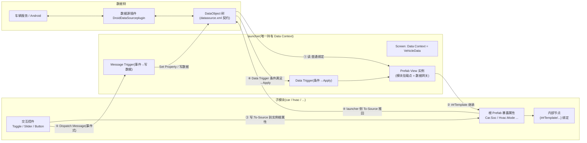

# 数据接收与发送节点(Data In / Data Out)

> 清单产物 2/9。定义本工程里 **UI 节点如何"收数据"与"发数据"** 的标准做法:有哪几种节点/机制、分别何时用、每条链路的完整路径,并给出与 `IVI/assets/xml/datasource.xml` 的字段对照。
> 机制依据 Kanzi 3.9.15 官方文档:Data sources / Bindings / Triggers;工程内落地方式见 [data-source.md](data-source.md)。

## 1. 一张图:数据进出 UI 的所有通道

## 2. 接收节点(Data In):三种机制

### 2.1 普通绑定(值 → 属性,最常用)

| 项 | 说明 |
|----|------|
| 所在位置 | **launcher** 的 Prefab View 实例属性上(子模块设计期看不到数据源) |
| 做法 | 选中 Prefab View → 目标属性 `+ Add Binding` → 表达式指向 `{DataContext.Charging.soc}` 等 |
| 触发 | 数据变 → 绑定自动求值 → 属性刷新(无需代码) |
| 表达式加工 | 绑定表达式支持运算/函数,如 `{DataContext.Charging.soc} / 100`、`string(...)` |

### 2.2 `##Template` 属性继承(launcher → 子模块内部)

子模块内部节点**永远只绑自己模块的暴露属性**:

1. 子模块根 Prefab 建自定义属性(如 `Hvac.Mode`,Int,给设计期默认值);
2. 内部节点绑 `{##Template/Hvac.Mode}`;
3. launcher 在 Prefab View 上把 `Hvac.Mode` 绑到 `{DataContext.Hvac.hvacMode}`。

好处:子模块可独立预览(默认值)、与数据源零耦合、接口显式可评审。

### 2.3 Data Trigger(条件 → 临时施加)

- **Data Trigger** 监视数据源/属性值,条件为真时执行 **Apply Property Action**(条件不再满足自动**回滚**)。
- 适合"故障置灰、超限告警高亮"这类**有条件的临时状态**,不适合常规值展示。
- 例:`{DataContext.Tires.tiresValid} == false` → Apply `Opacity = 0.4` 到轮胎面板。

## 3. 发送节点(Data Out):两种机制

### 3.1 To-Source 绑定(属性回写,适合"连续值/开关")

链路(两段式,见 §1 图 ③④):

1. **子模块内**:交互控件把值 To-Source 写到实例根属性(Binding Mode=To Source,Push Target=`##Template/Hvac.TargetTemp`);
2. **launcher 内**:Prefab View 上再加一条 To-Source,把 `Hvac.TargetTemp` 推到 `{DataContext.Hvac.targetTemp}`。

规则:**UI 显示以数据源回推的真值为准**(写失败要能看出来,不做本地乐观假象)。

### 3.2 Message + Trigger(事件式,适合"命令/瞬时动作")

1. 子模块控件 `Dispatch Message` 发自定义消息 `Msg_Hvac_SetMode`(带参数 `Hvac.TargetMode`);
2. launcher 在挂载点加 **Message Trigger** 拦截(消息沿节点树**冒泡**,父节点可统一处理);
3. Trigger 的 Action(Set Property / 插件侧处理)把值写入数据源。

选择标准:**有"当前值"语义→ To-Source;是"动作/命令"语义(下一首歌、寻车鸣笛)→ Message**。

## 4. 节点类型 × 数据方向 对照表

| Kanzi 节点/组件 | 方向 | 典型绑定 | 契约字段示例 |
|----------------|------|----------|--------------|
| Text Block 2D/3D | 收 | `Text` ← string/数值格式化 | `System/timeText`、`Charging/rangeKm` |
| Image / 图标 | 收 | 状态机换图 或 URI | `System/networkLevel`、`Demo/iconUri` |
| 进度/表盘(Rectangle+绑定 / Range) | 收 | `Value`/宽度 ← float | `Charging/soc` |
| 3D 节点 Transform | 收 | 旋转/位移 ← float/bool | `VehicleControl/doorFrontLeft` → `Door_FL` 旋转 |
| State Manager(Controller Property) | 收 | 状态 ← int/bool 枚举 | `Hvac/hvacMode`、`Tires/statusFL`(见 [state-machines/](state-machines/README.md)) |
| Toggle Button 2D | 收+发 | `Toggle State` ↔ bool | `Interior/ambientOn`、`VehicleControl/headlightOn` |
| Slider | 收+发 | `Value` ↔ int/float | `Hvac/targetTemp`、`Interior/ambientBrightness` |
| Button 2D | 发 | Click → Message | 模式切换、寻车等命令 |
| List Box | 收 | `Items Source` ← list | `Demo/menu` |
| Data Trigger(节点组件) | 收 | 条件 → Apply | `*Valid == false` → 故障态 |

## 5. 与契约的对照与规则

- 每个"接收/发送"链路必须能落到 `IVI/assets/xml/datasource.xml` 的一个字段;**没有字段就先改契约**(评审),再连线。
- 读写混合字段(如 `targetSoc`、`targetTemp`、`hvacMode`)= 读绑定 + To-Source 双链路,两条都要建。
- 每个关键信号消费方**必须同时消费 `<signal>Valid`**:Valid=false 时禁用交互并显示故障态(用 Data Trigger 或状态机)。
- 子模块暴露属性即模块的**数据接口清单**,新增/变更需更新模块文档中的"连线对照表"。

## 6. 快速自检

- [ ] 子模块内部没有任何直接对数据源的绑定(全部经 `##Template`)
- [ ] 每个写操作能说清是 To-Source 还是 Message,且语义匹配
- [ ] 所有关键信号有 Valid 消费逻辑
- [ ] Prefab View 上的连线与模块文档的对照表一致
