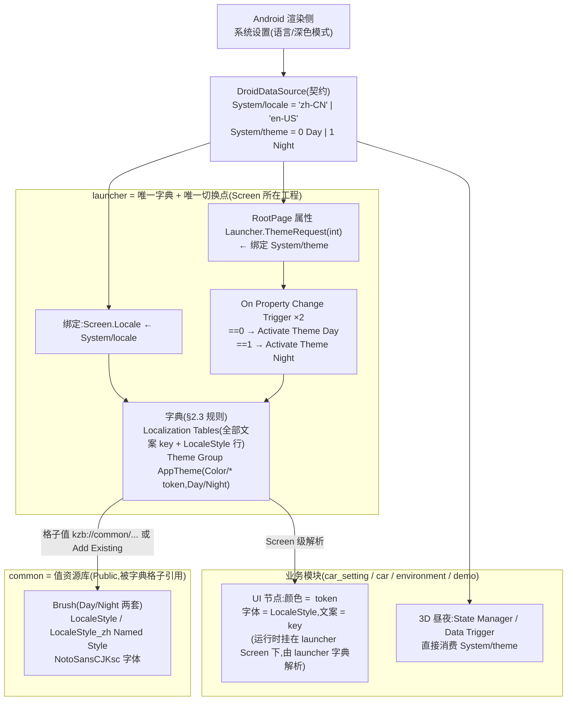

# 多语言与多主题 — 设计架构方案

> 依据 **Kanzi 3.9.15 官方文档** + 本仓库**当前实际资产**给出的落地架构。原则速查见 [localization-and-theme.md](../localization-and-theme.md);Trigger/Action 白名单见 [trigger-guide.md](trigger-guide.md)。
>
> 本文所有"现状"均核对自工程文件(`launcher.kzproj` / `common.kzproj` / `demo.kzproj` / `datasource.xml`),所有机制均标注官方出处。

## 1. 结论速览

**一条铁律决定整个架构**(官方对本地化与主题用同一句话规定,见 §2.3):

> 多工程组合的应用里,**Localization Table 和 Theme Group 必须对主工程(含 Screen 的 launcher)的 Screen 节点可见**——定义在被引用工程(common)里的表/主题组,其他工程经 resource ID **找不到**。

由此:

| 关注点 | 结论 |
|--------|------|
| **字典放哪**(Localization Table / Theme Group) | **只放 launcher**(主工程)。common 里现有的表和 `AppTheme` 是放错了位置,要迁移(§6) |
| **值资源放哪**(brush / style / 字体 / 贴图) | **common**(Public)。字典的每个格子可以用 `kzb://common/...` URL 或 Add Existing 指向 common 的资源——官方明确支持,launcher 表里 `LocaleStyle` 行已经这么用了 |
| 模块感知什么 | **零感知**:节点只写 resource ID(`Color/Surface`、文案 key)和 `LocaleStyle`;运行时模块 prefab 实例挂在 launcher 的 Screen 下,由 launcher 的字典解析 |
| 谁决定语言/主题 | **Android 侧**,经契约 `System/locale`(string)、`System/theme`(int)下发——字段已预留 |
| 谁执行切换 | **只有 launcher**(与 trigger 白名单"Activate Theme / Set Locale 只允许 launcher"一致) |
| 3D 场景日夜 | 不走 UI 主题,同一个 `System/theme` 字段由 environment/car 模块用 State Manager / Data Trigger 自行消费 |

## 2. 官方机制依据(Kanzi 3.9.15)

### 2.1 本地化(Localization)

出处:[Localization](https://docs.kanzi.com/3.9.15/en/working-with/localization/localization.html)、[Using locales](https://docs.kanzi.com/3.9.15/en/working-with/localization/using-locales.html)、[Localizing applications](https://docs.kanzi.com/3.9.15/en/working-with/localization/localizing-applications.html)

- **Locale 是资源选择 ID**:可本地化的不只文本,还有字体、贴图、Style、材质等;节点持有 resource ID,表记录"哪个 locale 用哪个资源";**未定义的 locale 回退默认 locale**(`neutral` 列)。
- **切换语言 = 改 Screen 节点的 `Locale` 属性**:官方原文 "To set a locale using a control, use any trigger and the **Set Property** action to set the value of the **Locale** property in the **Screen** node";侦听变化用 On Property Change。
- **PO 文件**导入/导出:`Import All Localization Tables` 会读取 `<工程>/Localization/` 目录下的全部 PO(官方固定目录)——译文可外部统一管理,导入时自动补建 locale。
- **Locale pack**:某 locale 的资源可拆成独立 kzb,导出到 `<BinaryExportDirectory>/Locale_packs/`(目录名固定),运行时 Engine API 按需加载;要留在主 kzb 的资源加 **Is Used By Code** 属性。
- 支持**多张表**并存,官方建议按应用部位/分工/送翻拆表。

### 2.2 主题(Themes)

出处:[Using Themes](https://docs.kanzi.com/3.9.15/en/working-with/themes/using-themes.html)、[Theming applications](https://docs.kanzi.com/3.9.15/en/working-with/themes/theming-applications.html)、[Setting the Screen node](https://docs.kanzi.com/3.9.15/en/working-with/screens/screens.html)

- **Theme Group = 一组 Theme**;每组同时只有一个 Theme 激活;resource ID 在当前 Theme 未定义时**回退该组 Default Value 列**。
- **可多组并存**(官方示例:一组管车型、一组管界面风格)——为"车型主题 × 日夜主题"留正交扩展位。
- **切换**:① 设计期 Selected Theme / Dictionaries > Locales and Themes(预览);② Trigger + **Activate Theme** action;③ C++ `screen->activateTheme("kzb://<project>/Themes/<Group>/<Theme>")`。
- **Theme 格子的值可以跨工程**:Theme Editor 里选 `< URL >` 填 `kzb://` 指向另一工程的资源(官方原文举例"use a font from another Kanzi Studio project")。

### 2.3 多工程组合的硬约束(本设计的根据)★

**两处官方原文,措辞完全一致**:

> *Using localization in multiple Kanzi Studio projects combined into a Kanzi application*([出处](https://docs.kanzi.com/3.9.15/en/working-with/localization/localizing-applications.html)):
> "you must make the **localization tables accessible to the Screen node of the main project** of your application in one of these ways:
> ① Define the localization tables **in the main project**;
> ② **Merge** the localization tables from referenced projects **to the main project** which contains the Screen node(见 [Merging projects](https://docs.kanzi.com/3.9.15/en/working-with/projects/merging-projects.html));
> ③ Contact the Rightware support team and request the **Kanzi Engine plugin** which enables you to use localization across multiple Kanzi Studio projects and kzb files."
>
> *Using themes in multiple Kanzi Studio projects combined into a Kanzi application*([出处](https://docs.kanzi.com/3.9.15/en/working-with/themes/using-themes.html)):对 **theme groups** 的规定逐字相同(①主工程定义 / ②Merge 到主工程 / ③向 Rightware 要跨工程插件)。

**推论**:把语言文案/主题组定义在 common,再让引用 common 的工程用 resource ID 取——**官方不支持**(这正是实测"找不到"的原因)。方式③依赖 Rightware 私发插件,不可控;**本方案采用①为主、②为并行开发工作流**。

## 3. 项目现状盘点(2026-07 核对)

### 3.1 已有资产

| 位置 | 资产 | 明细 | 评价 |
|------|------|------|------|
| `IVI/assets/xml/datasource.xml` | 契约字段 | `System/locale`(string,默认 `zh-CN`,注释 "zh-CN / en")、`System/theme`(int,0 Day / 1 Night) | ✅ 已预留 |
| `IVI/KanziProject/Shared/common/v101_sedan/common.kzproj` | Localization Table(locale:`neutral`/`en-US`/`zh-CN`,key:`LocaleStyle`) | **放错位置**:按 §2.3 对其他工程不可见 | ⚠️ 迁 launcher |
| | Theme Group `AppTheme`(`DefaultValues`/`Day`/`Night`;token:`Color/Accent、Divider、Error、Success、Surface、TextPrimary、TextSecondary、Warning`) | 同上,**放错位置**;另有杂散 key `a` | ⚠️ 迁 launcher |
| | `NotoSansCJKsc` 字体、`LocaleStyle`/`LocaleStyle_zh` Named Style、各色 Brush | **值资源,位置正确**(Public,供字典格子引用) | ✅ 留 common |
| `IVI/KanziProject/launcher/Tool_project/launcher.kzproj` | Screen `Locale` 写死 `zh-CN`;Localization Table(locale 仅 `neutral`/`zh-CN`;key `LocaleStyle`→`kzb://common/Styles/LocaleStyle_zh`、`title`) | 表的位置正确;`LocaleStyle` 行证明**格子值跨工程引用 common 可行**;缺 `en-US` 列 | ⚠️ 补列 |
| | `System.theme` 消费:仅 Env 节点一条 **disabled** 绑定 + 调试 Text Block | 未接任何 Theme | ⚠️ 待接 |
| `IVI/KanziProject/demo/demo.kzproj` | 节点引用 `Color/Accent`/`Color/Surface`/`Color/TextPrimary`/`LocaleStyle` resource ID | 节点侧写法正确;但 AppTheme 在 common → 按 §2.3 解析不到(与实测"找不到"一致)。**AppTheme 迁到 launcher 后,这些节点不用改**,运行时(demo 页挂在 launcher Screen 下)即可解析 | ✅ 保持 |
| `IVI/car*` `IVI/KanziProject/environment` | 无本地化/主题资产 | 按 §6 规范接入 | — |

### 3.2 问题清单(设计要解决的)

| # | 问题 | 影响 |
|---|------|------|
| **G0** | **字典定义在 common,违反官方多工程规则(§2.3)** | 引用工程经 resource ID 找不到文案/token —— 实测已复现,**根因** |
| G1 | locale 值不统一:契约注释 `en`,表列名 `en-US` | Android 下发 `en` → 整体回退默认 locale,英文不生效 |
| G2 | launcher 表缺 `en-US` 列,`LocaleStyle` 各列都指 `_zh` | 字体切不了英文 |
| G3 | `Screen.Locale` 写死、`System/locale` 无消费者 | 语言链路未通 |
| G4 | `System/theme` 未接任何 Theme | 主题链路未通 |
| G5 | `AppTheme` 杂散 key `a`;缺 `Color/Background` 等 token | 清理 + 按需补 |
| G6 | 业务模块未接 token/LocaleStyle/文案 key | 按规范接入 |

## 4. 目标架构

**数据驱动、单点执行、字典与值分离**:切换指令来自数据契约;字典与切换只在 launcher;值(具体 brush/style/字体)在 common;模块只消费 resource ID。

## 5. 设计决策

### D0 字典归 launcher,值归 common(修 G0,依据 §2.3)★

- **Localization Table、Theme Group 只在 launcher 定义**(官方方式①);common 里现有的表和 `AppTheme` 迁移到 launcher(操作见 §6.1)。
- **brush / Named Style / 字体留在 common(Public)**:字典格子用 **Add Existing**(引用工程资源在下拉里可选)或 **`< URL >` 填 `kzb://common/...`**(官方明确支持)指向它们——launcher 表 `LocaleStyle` 行已是活例。
- 模块节点**只写 resource ID**,不引用字典本身 → 模块对字典位置零感知,迁移不改模块。

### D1 locale 命名统一为 `zh-CN` / `en-US`(修 G1/G2)

- `datasource.xml` 注释 `en`→`en-US`(值是 string,无结构变更,Android 侧同步确认);
- launcher 表补 `en-US` 列;`LocaleStyle` 行:`zh-CN`→`LocaleStyle_zh`,`en-US`→`LocaleStyle`(拉丁),`neutral`(回退)→`LocaleStyle_zh`;
- 新增语言 = 契约枚举 + launcher 各表加列,不改任何节点。

### D2 token 清单(修 G5)

清理 `AppTheme` 杂散 key `a`;补 `Color/Background`;`Font/* Size/* Motion/*` 按 [naming-conventions.md](naming-conventions.md) **用到即建**。

### D3 主题切换链路(修 G4)— Studio 内实现,零 C++

1. RootPage 加自定义 int 属性 `Launcher.ThemeRequest`,OneWay 绑定 `{DataContext.DroidDataSource.System.theme}`;
2. RootPage 挂两条 **On Property Change**(监视该属性)Trigger:Condition `==0` → **Activate Theme** `AppTheme/Day`;`==1` → `AppTheme/Night`;
3. `AppTheme` 的 Selected Theme 设为契约默认值对应的 `Night`。

> AppTheme 迁到 launcher 后,Activate Theme action 在本工程内直接可选(原跨工程可选性风险不存在了)。C++ `activateTheme` 仍是备用手段。

### D4 语言切换链路(修 G3)

首选:Screen 的 `Locale` 属性 OneWay 绑定 `{DataContext.DroidDataSource.System.locale}`。
**验证点 V2**:若 Screen 上建绑定不可行,退官方字面做法——RootPage `Launcher.LocaleRequest`(string)绑定契约值,On Property Change + **Set Property** 写 `Screen.Locale`。

### D5 文案工作流:launcher 多表 + PO 单一来源;并行开发用 Merge(官方方式②)

- launcher 里**按模块建表**:`Table_launcher`、`Table_car_setting`…(官方明确多表就是为分工/送翻);key 命名 `<模块>.<语义>`,冻结只追加;
- **译文单一来源 = PO**,放官方固定目录 `IVI/KanziProject/launcher/Tool_project/Localization/`(`Import All Localization Tables` 自动读取);
- 模块 Text 节点只填 resource ID(key)。**模块工程独立预览时文案显示不出来是官方模型的固有代价**,两种应对:
  - **标准流(推荐)**:文案验收一律在 launcher 工程 Preview 做(模块页挂在 launcher Screen 下,字典生效);模块独立预览只看布局;
  - **并行流(模块团队要看到真文案时)**:模块工程内自建同 key 开发表(仅供本工程预览),交付节点用 **File > Import > Merge Project** 把模块表并入 launcher(官方方式②;Kanzi 提供三方合并与冲突解决,可增量重复合并)。运行时以 launcher 的表为准,模块 kzb 里那份表不生效、仅冗余体积。

### D6 3D 场景日夜与 UI 主题解耦

Env 节点那条 disabled 绑定的意图正确:3D 昼夜(光照/天空盒/贴图)不是 brush token,不走 `AppTheme`;environment/car 直接消费 `System/theme` 字段,用 State Manager 切换(规范见 [state-machine-guide.md](state-machine-guide.md))。UI 主题与 3D 昼夜是同一字段的两个消费者,天然同步、互不耦合。

### D7 分包与 OTA(远期)

- 语言多于 2 种时,非默认语言标 locale pack,导出到 `IVI/assets/Locale_packs/`(Studio 固定目录名),Android 侧 Engine API 按 locale 加载;需进主 kzb 的资源加 **Is Used By Code**;
- 主题不支持分包(theme 资源在主 kzb);车型差异将来用第二个 Theme Group(§2.2)或 `IVI/KanziProject/Shared/carmodel/` 变体。

## 6. 具体 Studio 操作步骤

### 6.1 一次性迁移:字典从 common → launcher(修 G0,先做)

1. 打开 `launcher.kzproj` → **File > Import > Merge Project** → 选 `IVI/KanziProject/Shared/common/v101_sedan/common.kzproj`;
2. Project Merge 对话框里**只勾**:`Localization > Localization Table`、`Themes > AppTheme`(勾 *Select referenced items* 让 Studio 自动带上引用项;若把 brush/style 一并带来了,取消勾选——它们留在 common);
3. 合并后在 launcher 里核对:表的 locale 列(`neutral`/`en-US`/`zh-CN`)与 `LocaleStyle` 行、`AppTheme` 的 8 个 token + `Day`/`Night` 列都在;**格子值应指向 `kzb://common/...`**(不是本地副本);
4. Theme Editor 里删除杂散 key `a`(右键 → Delete Resource ID);
5. 回 `common.kzproj`:删除其 Localization Table 与 `AppTheme`(防止再被误用);Brush/Style/字体保持 Public 不动;
6. 两工程都 Save + Export KZB,launcher Preview 里 Dictionaries > Locales and Themes 切 `Day`/`Night`、`zh-CN`/`en-US` 验证 demo 页 token 与字体随切换刷新(demo 节点已写好 resource ID,应立即生效)。

> 内容量小(1 个 key + 8 个 token),若 Merge 冲突处理麻烦,**手动在 launcher 重建同名表/组**是等价做法:Theme Editor → + Add Resource → **Add Existing** 选 common 的 brush,或格子里 `< URL >` 填 `kzb://common/Materials and Textures/Brushes/...`。

### 6.2 多语言(操作序列)

1. **补列**(G1/G2):launcher 任一表 → Localization Editor → + Create Locale `en-US`(自动加到本工程所有表);`LocaleStyle` 行三列按 D1 指定;
2. **建文案表**:Library > Localization(Alt+右键)→ Localization Table → `Table_car_setting`;+ Add Resource → Create > Text,key 如 `car_setting.title`,填 `neutral`/`zh-CN`/`en-US` 三列文案;
3. **模块节点引用**:模块工程里 Text Block 的 `Text` 属性 → 下拉选 `< Resource ID >` → 填 `car_setting.title`(模块工程内显示不解析是预期,见 D5);
4. **切换链路**(G3):launcher Screen 节点 `Locale` 属性 → Binding Editor 建 OneWay 绑定 `{DataContext.DroidDataSource.System.locale}`(不可行则按 D4 的 V2 退路);
5. **契约对齐**(G1):`datasource.xml` 注释改 `zh-CN / en-US`,与 Android 侧确认下发值;
6. **验证**:改 `datasource.xml` 里 `locale` 默认值为 `en-US` → 重启 Preview,launcher 的 `title`、模块文案、字体全部切英文;运行期由 Android 改值即时切换;
7. **送翻**:Library > Localization 右键 → Export All Localization Tables → PO 交译 → Import All Localization Tables(PO 放 `Tool_project/Localization/`)。

### 6.3 多主题(操作序列)

1. **准备双套值**(如缺):common 里为每个 token 建 Day/Night 两个 brush(`Brush_Bg_Day`/`Brush_Bg_Night`…),Make Public;
2. **字典**:launcher 的 `AppTheme`(6.1 已迁入)Theme Editor 里逐 token 指定 Day/Night 两列(Add Existing / `< URL >` 指 common brush);Default Value 列给回退值;
3. **模块节点引用**:颜色类属性(Background Brush / Foreground Brush 等)→ `< Resource ID >` → `Color/Surface` 等(demo 已有先例,照抄);
4. **切换链路**(G4,D3):RootPage 加 int 属性 `Launcher.ThemeRequest` + 绑定;Node Components > Triggers 加两条 On Property Change(Condition `==0`/`==1`)分别挂 **Activate Theme** `Day`/`Night`;
5. **初值**:Library > Themes > AppTheme 的 Selected Theme = `Night`(与契约 `theme=1` 一致);
6. **验证**:Preview 里 Dictionaries 切 Day/Night 先验字典;再改 `datasource.xml` `theme` 默认值 0/1 重启 Preview 验链路;
7. **3D 昼夜**(D6):environment 里恢复/重建对 `System/theme` 的消费(State Manager 两态切光照贴图),与 UI 主题无耦合。

### 6.4 FAQ:模块独立开发怎么办

**Q1:单独打开子工程,文案/主题色是不是看不到?会不会报错?**

看不到,但**不报错**。resource ID 是运行时弱引用:解析失败只回退默认值(Text 显示为空、brush 不生效),Preview 正常启动、Export KZB 正常导出,Studio Log 里只有解析失败的 warning——不阻塞开发,区别于 `kzb://` 直链断链。

**Q2:子工程要提前知道主工程的 resource ID,是不是就没法独立开发?**

resource ID 本来就是一份**契约**——这正是 Kanzi resource ID 间接寻址的设计意图,和 `datasource.xml` 字段的性质完全一样:**契约先行,照单开发**。模块开发者需要的不是打开 launcher 工程,而是两份清单:

- **token 清单**:`Color/*` 等(见 [naming-conventions.md](naming-conventions.md),新增 token 走评审后同时更新清单与 launcher 字典);
- **文案 key 规范**:`<模块>.<语义>`,模块自己起名、交付时进 launcher 表(前缀即命名空间,新增 key 不冲突)。

**Q3:开发期想在模块 Preview 里看到真实效果怎么办?**

两种工作流,按团队情况选:

| 工作流 | 做法 | 独立预览效果 | 成本 |
|--------|------|--------------|------|
| **简单流(推荐先用)** | 模块只写 resource ID,不建本地字典 | 布局可见,文案/主题色空缺 | 零维护;效果验收统一在 launcher Preview 做(模块页挂上后字典即生效) |
| **并行流(模块团队大/页面多时)** | 模块工程自建**开发用字典**:同 token ID 的 Theme Group + 同 key 的文案表(值可直接引 common 的 public brush/style) | 完整可见,可用 Dictionaries 切语言/主题自测 | 双份维护;交付节点用官方 **Merge Project** 把模块表并入 launcher(§2.3 方式②,三方合并可增量重复) |

并行流之所以安全:模块工程的字典挂在**模块自己的预览 Screen** 上(架构铁律:子工程 Screen 仅用于独立预览,不参与运行时),运行时生效的只有 launcher 字典,两者同 key 不冲突,模块 kzb 里那份仅是少量体积冗余。若采用并行流,建议做一个**模块起步模板**(预置全套 token 的 dev Theme Group + 空文案表),保证各模块独立开发体验一致。

> 若两种工作流都嫌重,官方还有方式③:向 Rightware 申请跨工程本地化/主题插件(§2.3)——量产前可评估,但外部依赖不可控,本方案不默认采用。

## 7. 落地阶段与验收

| 阶段 | 内容 | 验收 |
|------|------|------|
| **P0 迁字典 + 修不一致**(G0/G1/G2/G5) | §6.1 迁移;补 `en-US` 列;契约注释对齐;清杂 key | Dictionaries 里切 locale/theme,launcher `title`、demo token/字体正确切换 |
| **P1 打通切换链路**(G3/G4) | §6.2 步骤 4、§6.3 步骤 4-5;核销 V2 | 改契约默认值重启 Preview 即切;运行期 Android 改值即时切 |
| **P2 首个业务模块接入**(G6) | car_setting 按 §6.2 步骤 2-3、§6.3 步骤 3 接入;PO 流程跑通;environment 接 `System/theme` | 切语言/主题,car_setting 页面与 3D 场景全量刷新,无写死残留 |
| **P3 分包/OTA**(D7,远期) | 非默认语言 locale pack 化;Android 加载联调 | 主 kzb 体积下降,动态加载语言包成功 |

**剩余验证点**:

| # | 事项 | 预案 |
|---|------|------|
| V2 | Screen.Locale 能否直接建绑定 | On Property Change + Set Property(官方字面做法,必可行) |
| — | 模块工程独立预览看不到真文案/主题色(官方模型固有) | 验收在 launcher Preview 做;或模块自建开发表 + Merge(D5 并行流) |

## 8. 反模式(沿用并强化)

- **把 Localization Table / Theme Group 建在 common 或任何子工程里当共享字典用**(官方多工程规则不支持,§2.3)——字典只建 launcher。
- TextBlock 直接填中文/英文字面量;节点写死十六进制颜色/固定字号。
- 模块工程里放 Activate Theme / Set Locale(只允许 launcher)。
- 漏译回退成 key 名/空串不报缺陷;用默认值掩盖 `locale`/`theme` 数据无效。
