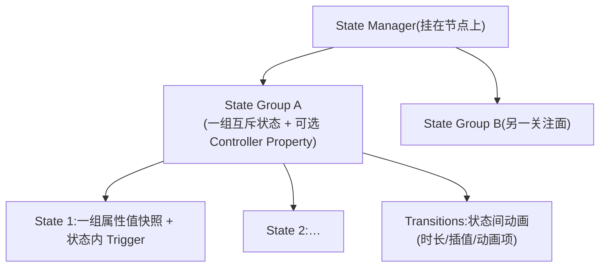
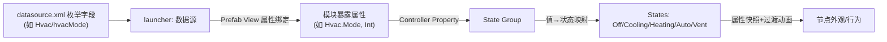
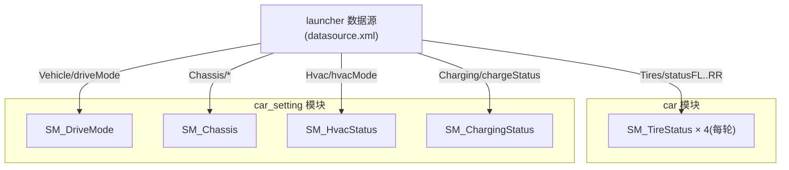

# 状态机(State Manager)总纲

> 清单产物 3/9。讲清 Kanzi 3.9.15 的状态机机制、本工程的统一用法与规范;5 个具体状态机的设计规格见本目录:
>
> | 状态机 | 文档 | 驱动字段 |
> |--------|------|----------|
> | 充电状态 | [sm-charging.md](sm-charging.md) | `Charging/chargeStatus` |
> | 驾驶模式(经济/标准/性能) | [sm-drive-mode.md](sm-drive-mode.md) | `Vehicle/driveMode` |
> | 底盘控制(悬架高度) | [sm-chassis.md](sm-chassis.md) | `Chassis/suspensionLevel` + `suspensionMoving` |
> | 轮胎状态(四轮) | [sm-tires.md](sm-tires.md) | `Tires/statusFL..RR` |
> | 空调状态 | [sm-hvac.md](sm-hvac.md) | `Hvac/hvacMode` |
>
> 官方依据:[State manager](https://docs.kanzi.com/3.9.15/en/working-with/state-managers/state-managers.html)、[Using state managers](https://docs.kanzi.com/3.9.15/en/working-with/state-managers/using-state-managers.html)。

## 1. 概念模型

Kanzi 的 State Manager 挂在**节点**上,内部结构:

- **State = 属性值快照**:进入状态时把记录的属性值施加到节点(优先级高于默认/继承/本地值),离开时撤销;状态还能带自己的 Trigger(进入状态才挂上)。
- **State Group = 一个关注面**:组内状态互斥;一个 State Manager 可有多个 Group,分别记录不同属性集合(State Tools 里勾选每组"记录哪些属性")。
- **Transition = 状态间动画**:默认线性,可在 State Transition Editor 里按 From→To 精调时长/插值/动画。

## 2. 两种驱动方式与选择

| 方式 | 机制 | 适用 | 本工程用法 |
|------|------|------|-----------|
| **Controller Property**(首选) | 给 State Group 设一个控制属性,每个 State 配一个属性值;属性变→状态自动切 | 状态由**数据**决定(车辆信号、模式枚举) | 控制属性=模块暴露属性(`##Template`),launcher 把数据源字段绑进来;**5 个状态机全部用这种** |
| **Go to State / Next / Previous Action** | Trigger 触发 Action 显式切状态 | 状态由**交互**决定(点击切页、演示轮播) | 仅用于演示按钮/导航;注意:控制属性一旦变化会**覆盖** Action 设的状态,同一 Group 不要混用 |

数据驱动标准链路(所有状态机同构):

## 3. Studio 操作模板(通用步骤)

以下步骤适用于全部 5 个状态机,各 spec 文档只写差异(状态表/映射值/属性快照):

1. **准备控制属性**:在模块根 Prefab 建自定义属性(Int,给设计期默认值),内部目标节点可见;
2. **创建状态机**:Node Tree 选目标节点 → Preview 下方 **State Tools** → `Create State Manager`;
3. **建状态**:`Create State` 逐个创建并重命名(名字按 spec 的状态表);
4. **设控制属性**:State Tools 顶部下拉选属性(或 `+ Create Property Type`)→ 给每个 State 填映射值;
5. **录属性快照**:把节点调到该状态的目标外观 → 点该 State 下的保存按钮(先在 State Group 上勾选要记录的属性);
6. **配过渡**:State Transition Editor 里按 spec 的过渡表设时长/插值;
7. **验证**:Preview 里改控制属性值(或 Dictionaries 面板)看切换;再从 launcher 绑数据源做端到端验证;
8. **收尾**:状态机命名 `SM_*`、Group 命名 `SG_*`(见 [naming-conventions.md](../naming-conventions.md)),Prefab Make Public。

## 4. 工程规范

1. **枚举即契约**:State 集合与 `datasource.xml` 枚举注释一一对应;新增状态 = 先改契约再改 Studio。
2. **一关注面一 Group**:如底盘的"高度"(Low/Mid/High)与"运动中"(Idle/Moving)分两个 Group,禁止摊平组合。
3. **必有故障态**:凡驱动字段有 `<signal>Valid`,状态机须含 `Fault`(或用第二个 Group `SG_Validity` 盖故障蒙层);**禁止 Valid=false 时停留在正常态**。
4. **未知值兜底**:控制属性收到映射外的值时应落在 `Unknown`/安全态(把 Unknown 设为第一个/默认状态)。
5. **状态只改外观属性**,不在 State 里藏业务写操作;写数据走 [data-io-nodes.md](../data-io-nodes.md) 的 To-Source/Message。
6. **过渡时长走档位**(100/200/300ms,见 conventions.md 动效条款);仪表类关键信息优先 Immediate,装饰动画才用长过渡。
7. 状态机放**子模块**(跟着 UI 走),驱动数据经 launcher 连线;spec 文档必须含"连线对照表"。

## 5. 状态机 × 节点 × 数据 全景

> 归属说明:充电/驾驶模式/底盘/空调的**页面级**状态机先落在 `car_setting`(2D 设置页);轮胎状态机落在 `car`(随 3D 车模)。后续若拆出独立 hvac/charging 模块,状态机随根 Prefab 整体迁移,接口(暴露属性)不变。

## 6. 特例:3D 摄像头 × 手势旋转

launcher 3D 场景的 **CameraView + ResetCameraRotation** 不属于上述 5 个数据驱动状态机,而是「预设视角 + 手势旋转」的双状态机协作,详见:

- **[camera-view-and-gesture.md](camera-view-and-gesture.md)** — 属性分工、触发器时序、Studio 配置清单与验收步骤
