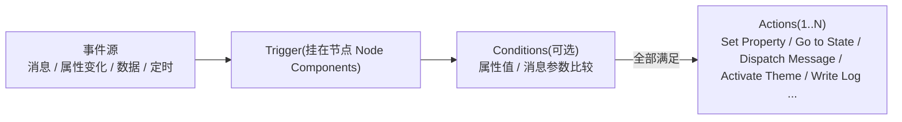

# Trigger 指南(触发器 / 条件 / 动作)

> 清单产物 4/9。Kanzi 3.9.15 的 Trigger/Action 体系 + 本工程的选型与规范。
> 官方依据:[Triggers](https://docs.kanzi.com/3.9.15/en/working-with/triggers/triggers.html)、[Using triggers](https://docs.kanzi.com/3.9.15/en/working-with/triggers/using-triggers.html)、[Triggers reference](https://docs.kanzi.com/3.9.15/en/working-with/triggers/reference-for-triggers.html)、[Actions and messages reference](https://docs.kanzi.com/3.9.15/en/working-with/triggers/reference-for-actions.html)。

## 1. 模型:Trigger = 条件源,Action = 结果



- Trigger 挂在**节点**的 `Node Components > Triggers` 下(Alt+右键添加);一个事件可挂多个 Trigger,各带自己的条件与动作。
- **消息机制**:消息先**隧道下行**(tunneling)到目标节点,再**冒泡上行**(bubbling)经过祖先节点;任何一层的 Message Trigger 都能拦截。`Set Message Handled = true` 时消息不再继续冒泡 —— 这是"父节点统一处理一组按钮"的基础。
- **Condition**:比较"属性值"或"消息参数"(如 `Message Argument State = 'Fault'`),全部满足才执行 Action。

## 2. 本工程常用 Trigger 清单(按场景)

| 场景 | Trigger | 说明/规范 |
|------|---------|-----------|
| 按钮点击 | `Button: Click` / `Toggle Button: Toggled *` | UI 交互入口;动作通常是 Dispatch Message 或 Go to State |
| 数据条件成立时改外观 | **`Data Trigger`** | 唯一能直接监视**数据源值**的 Trigger;只能配 **Apply** 类 Action(条件失效自动回滚)。故障置灰/告警高亮首选 |
| 属性变化 | `On Property Change` | 监视节点属性;做"值变化→派生动作"。注意与绑定重复时优先用绑定 |
| 节点挂载初始化 | `On Attached` | 进页面时的一次性动作(上报曝光、Write Log 调试) |
| 定时 | `On Timer` | 轮播、演示模式;量产 UI 慎用(耗电/性能) |
| 状态进出 | `Message Trigger > State Manager > Entered State / Left State` | 配 Condition(Message Argument `State == X`)做"进入某状态才做某事",如进入 Fault 播提示音消息 |
| 自定义命令 | `Message Trigger > <自定义 Msg_*>` | 子模块 → launcher 的事件通道(见 [data-io-nodes.md §3.2](data-io-nodes.md)) |
| 列表选择 | `List Box: Item Selected` | 菜单/列表页导航 |

> 完整分类(Activity / Focus / 手势 Manipulator / Page / Scroll View / Text Box 等)见官方 Triggers reference;上表是本工程的**白名单**,超出范围先评审。

## 3. 本工程常用 Action 清单

| Action | 用途 | 规范 |
|--------|------|------|
| `Set Property` | 直接改目标节点属性 | 仅限简单一次性赋值;成套外观变化必须走状态机 |
| `Apply Property Action` | Data Trigger 专用,条件期临时施加 | 故障/告警等**可逆**状态首选(自动回滚) |
| `Dispatch Message Action > State Manager > Go to State / Next / Previous` | 显式切状态 | 仅交互驱动的 Group;别与 Controller Property 混用同一 Group |
| `Dispatch Message`(自定义) | 发命令消息(带参数) | 命名 `Msg_<域>_<动词>`;launcher 拦截后写数据源 |
| `Activate Theme` | 切主题 | 只允许 launcher 用(Screen 级资源) |
| `Set Locale` | 切语言 | 同上 |
| `Write Log` | 调试输出 | 提交前移除或仅留关键点 |

## 4. 三个标准配方

### 4.1 故障置灰(Data Trigger + Apply)

```text
节点: TirePanel(car_setting)
Trigger: Data Trigger
  条件: {DataContext.Tires.tiresValid} == false
  Action: Apply Property Action → Opacity = 0.4
  Action: Apply Property Action → Hit Testable = false   (禁交互)
恢复: tiresValid 回 true 时自动回滚,无需第二条 Trigger
```

### 4.2 命令上行(子模块按钮 → launcher → 数据源)

```text
子模块: Button "SOS 寻车"
  Trigger: Button: Click
  Action: Dispatch Message → Msg_Vehicle_FindCar(无参数)

launcher: 挂载该模块的 Prefab View
  Trigger: Message Trigger → Msg_Vehicle_FindCar
    Set Message Handled = true
  Action: (经插件约定字段)Set Property / To-Source 写数据源
```

### 4.3 进入故障态时提示(Entered State + Condition)

```text
节点: 使用 SM_ChargingStatus 的节点
  Trigger: Message Trigger > State Manager > Entered State
  Condition: Message Argument [State] == "Fault"
  Action: Dispatch Message → Msg_System_PlayWarning
```

## 5. 反模式(评审拦截)

| 反模式 | 正确做法 |
|--------|----------|
| 用一串 `Set Property` 拼出"状态" | 建状态机,属性快照进 State |
| Data Trigger 里做写数据(业务副作用) | Data Trigger 只管外观;写走 To-Source/Message |
| 同一 State Group 既有 Controller Property 又被 Go to State 打 | 拆 Group 或去掉其一(属性变化会覆盖 Action 结果) |
| 子模块 Trigger 直接改 launcher/其它模块节点 | 消息冒泡到 launcher 处理,模块间零直连 |
| 满屏 On Timer 轮询数据 | 数据驱动走绑定/Data Trigger,不轮询 |
| 忘记 Set Message Handled 导致重复处理 | 拦截即置 Handled;需要穿透时写注释说明 |
