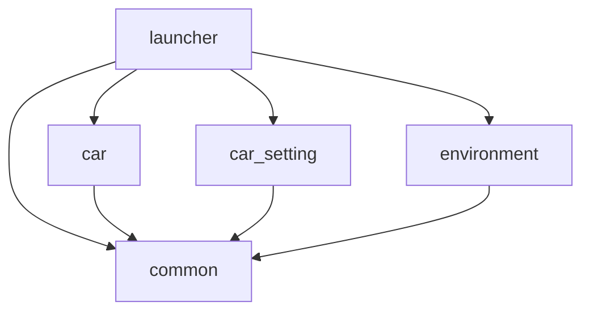

# 命名 / 引用 / Public 可见性 / 导出规范

## 1. 工程命名

- 工程名全小写、与 kzb 文件名一致:`launcher` / `common` / `car` / `car_setting` / `environment`。
- 新模块放 `IVI/<module>/<module>.kzproj`(子工程不需要完整目录结构)。

## 2. 节点 / Prefab 命名

- **PascalCase**,语义清晰。
- 模块**根页面 Prefab**:`<域>Page`,如 `CarSettingPage`、`MyModulePage`(命名稳定 = 下游/launcher 的加载入口,**交付后不改名**)。
- 通用组件(放 common):`Button`、`ToggleSwitch`、`Card`、`ListItem`、`Popup`、`Slider`、`StatusBar` 等。

## 3. 属性类型(Property Type)命名

- 自定义属性:`<命名空间>.<属性名>`,如 `CarControl.CarColor`。
- 命名空间一般用所属工程/模块名,便于追溯("这属性谁定义的")。

## 4. 数据字段命名

- 与 `datasource.xml`、Android 端 **逐字段一致**;字段 camelCase,分组用层级(`System` / `Charging` / `VehicleControl` / `Interior`)。
- 关键信号配 `<signal>Valid`(bool)故障字段。详见 [data-source.md](data-source.md)。

## 5. 工程引用(Project References)

依赖方向**单向无环**:



- 只允许 `launcher → 模块`、`模块/launcher → common`。
- **禁止**:`common → 上层`、`模块 ↔ 模块`、`launcher` 在设计期硬连模块内部节点。
- 添加引用:`Library > Project References > Add Existing Project`。

## 6. Public 可见性(跨工程能用什么)

被引用工程的内容**默认不暴露**,要让引用方能用,必须标 **Public**:

- 单项:选中 Prefab/资源 → Properties 设 `Visibility Across Projects = Public`(或右键 **Make Public**),public 项左上角有绿色标记。
- 整个工程:`Project > Properties` → `Resource Visibility Across Projects = Public`。

可跨工程共享:**Prefab、纹理、材质、字体、样式等资源**(标 Public 后用 `kzb://<proj>/...` 引用)。
**例外**:**本地化表、主题组(theme group)、数据源**在 Screen 节点层解析,跨工程需在含 Screen 的工程 define/merge 或专门处理(见 [localization-and-theme.md](localization-and-theme.md))。

## 7. 用 `##Template` 暴露可控属性

让 launcher/外部控制模块外观时:

- 在模块根 Prefab 上加自定义属性(如 `MyModule.AccentColor`)。
- 内部节点绑定到 `{##Template/MyModule.AccentColor}`(`##Template` = 该 Prefab 的实例根)。
- launcher 在 Prefab View 实例上设该属性即可控制模块。

## 8. 跨工程 URL

```text
kzb://common/Prefabs/Components/Button
kzb://common/Fonts/NotoSansCJKsc
kzb://car/Prefabs/Pages/CarPage
```

- 工程名全小写、稳定;改名会让所有引用与运行时加载失效。

## 9. 导出与版本控制

- 见 [export-kzb.md](export-kzb.md)。
- 大二进制走 **Git LFS**(`.gitattributes`);autosave/备份/锁/Temp/缓存/kzb 不入库(`.gitignore`)。
- 提交前 Studio 内 **Save**;`git reset/pull` 前先**关闭 Kanzi Studio**(否则插件 jar 被占用导致失败)。
