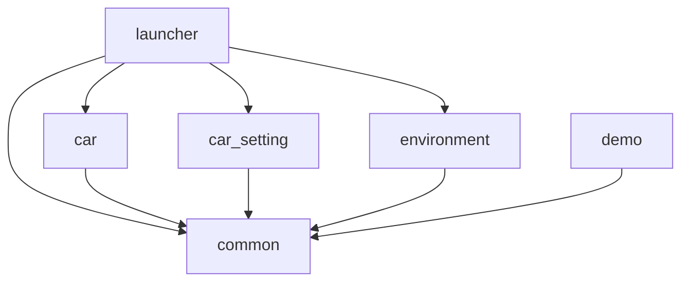

# 命名与开发规范(对齐 ScaniaGui 设计规范)

本文是 IVI/Kanzi 开发的**命名 + 资源 + 结构规范**,与《ScaniaGui Kanzi for Design Standards》对齐,面向开发落地。设计交付细则以设计规范原文为准;本文提取**开发必须遵守的规范性条款**并补充 Kanzi 工程侧约定。

> 通用命名铁律:**全小写、仅用下划线 `_`,禁止中文、空格、特殊字符;交付后命名冻结,只追加不改名。**

---

## 1. Kanzi 工程命名
- 工程名全小写,与 kzb 文件名一致:`launcher` / `common` / `car` / `car_setting` / `environment` / `demo`。
- 新模块放 `IVI/<module>/<module>.kzproj`(子工程不需要完整目录结构)。

## 2. 节点 / Prefab 命名
- **PascalCase**,语义清晰。
- 模块根页面 Prefab:`<域>Page`(如 `CarSettingPage`),命名稳定 = 下游/launcher 加载入口,**交付后不改名**。
- 通用组件(放 common):`Button`、`ToggleSwitch`、`Card`、`ListItem`、`Popup`、`Slider`、`StatusBar` 等。

## 3. 属性类型命名
- 自定义属性:`<命名空间>.<属性名>`(如 `CarControl.CarColor`),命名空间用所属工程/模块名,便于追溯。

## 4. 数据字段命名
- 与 `datasource.xml`、Android 端**逐字段一致**;字段 camelCase,分组分层(`System`/`Charging`/`VehicleControl`/`Interior`);关键信号配 `<signal>Valid`(见 [data-source.md](data-source.md))。

---

## 5. 资源命名规范(对齐设计规范)

### 5.1 2D 切图
格式:`模块_组件_状态_尺寸_分辨率.png`
- 全小写、下划线分隔;例:`cluster_btn_speed_normal_48px_1920x720.png`
- 状态取值:`normal` / `focus` / `press` / `disable` / `selected` / `highlight` 等。
- 同类型资源命名规则统一,便于 Kanzi 节点批量管理。
- 特殊效果 UI 资源按实际需求定,不强套此规则。

### 5.2 3D 部件
格式:`内外饰类型_部件名称_功能_材质类型`(全小写、下划线)
- 内饰:`int_cluster_panel_main_plastic`
- 外饰:`ext_car_body_front_metal`
- 功能件:`int_steering_wheel_button_volume`
- 层级按「内外饰 → 模块 → 部件」分,**与 Kanzi 节点层级一致**,禁止层级混乱/重名。

### 5.3 贴图
格式:`模型名称_贴图类型.png`
- 例:`int_cluster_panel_main_plastic_basecolor.png`
- 贴图类型:`basecolor` / `normal` / `roughness` / `metalness` / `ao`。
- 按内外饰/模块分文件夹,便于 Kanzi 批量赋值。

### 5.4 与 Kanzi 命名一致
- 设计图层名、切图名、3D 部件名、组件名,**原则上与 Kanzi 节点命名完全一致**,便于关联定位。

---

## 6. 结构对应(设计 ↔ Kanzi 一一对应)
- **UI 页面结构 / 3D 模型层级** 与 **Kanzi 结构、节点层级** 一一对应,禁止结构混乱。
- **组件化设计 ↔ Kanzi Prefabs**:所有可复用组件做成 Prefab,统一尺寸/间距/状态,禁止一页一重做。
- 组件需标注"最小可点击区域",避免触控误操作。

---

## 7. 工程引用 / Public / URL

依赖方向**单向无环**:

- 只允许 `launcher → 模块`、`模块/launcher → common`;**禁止** `common → 上层`、`模块 ↔ 模块`、launcher 设计期硬连模块内部节点。
- 添加引用:`Library > Project References > Add Existing Project`。
- **Public 可见性**:被引用内容默认不暴露,需 `Visibility Across Projects = Public`(或 Make Public)才能跨工程用;可共享 Prefab/纹理/材质/字体/样式;**本地化表/主题组/数据源**是例外(见 [localization-and-theme.md](localization-and-theme.md))。
- **`##Template` 暴露可控属性**:模块根 Prefab 加自定义属性,内部节点绑定 `{##Template/<NS>.<Prop>}`,launcher 在 Prefab View 实例上赋值控制。
- **kzb:// URL**:`kzb://common/Prefabs/Components/Button`、`kzb://common/Fonts/NotoSansCJKsc`;工程名全小写稳定,改名会让引用与运行时加载全失效。

---

## 8. 2D 资源规范(摘要)
- **分辨率/适配**:遵循物理分辨率 + DPI 双标准(仪表 1920×720),统一基准缩放(1px=1dp);复用组件支持动态分辨率适配。
- **格式/压缩**:除天空盒外统一 **PNG**;单张切图 ≤ **300KB**,背景类 ≤ **8MB**;仪表侧非必要少用 SVG。
- **图标**:大尺寸导出便于 Kanzi 缩放无锯齿。
- **图集(SpriteSheet)**:尺寸必须 **2^n**(最大 2048×2048,量产优先 1024×1024);无法固定尺寸则导出时强制变形、进 Kanzi 后 scale 恢复;禁止冗余/大留白。
- **像素对齐**:所有 UI 元素像素对齐且居中,禁止半像素/小数坐标;圆角、边框宽度为**偶数像素(2^n)**;阴影优先 Kanzi 实现且像素对齐。
- **状态完整性**:可交互组件交付完整状态切图(Normal/Focus/Press/Disable/Selected…),标注切换逻辑。
- **效果**:阴影/发光/模糊/渐变除静态资源外**不画死**,优先 Kanzi 的 Layer Effect / Material 实现;渐变需给明确色标与角度。
- **颜色**:RGB/RGBA 交付;台架色差优先 Kanzi 侧 Gamma 矫正;禁止仅用单色区分状态(需图标/文字辅助,适配色弱)。
- **资源冗余**:单页面 2D 资源(除背景)总量 ≤ **5MB**,超出需拆分/压缩。

## 9. 3D 模型规范(摘要)
- **面数上限**:内饰 5~10w 面 / 10~20w 三角面;外饰 15~20w 面 / 30~40w 三角面;装饰件(logo)≤ 300 三角面/个。
- **精度**:禁止重面/破面/重叠顶点,模型闭合无开放边。
- **轻量化**:删除不可见/被遮挡面,合并重复节点,除父节点外无多余空节点;**功能确认后冻结变换(旋转/缩放/位移)**,避免导入 Kanzi 偏移。
- **单位**:显示单位 **米(Meters)**,制作单位 **厘米(Centimeters)**;进 Kanzi 后按米制(1 单位 ≈ 1 米,glTF 米制;FBX 注意 cm→m ×100)。
- **坐标轴**:所有 mesh 重置 Transform 与 Scale,坐标 **(0,0,0)**,**Z 轴朝 Front,Y 轴朝 Top**,与 Kanzi 统一;动态部件用**虚拟体**(坐标在自身中心)绑定做动画。
- **轴心**:位于部件几何/功能中心(按钮=按压中心,指针=旋转中心),禁止偏移/悬空。
- **默认旋转 0°**,旋转逻辑统一在 Kanzi 内实现。
- **布线/光滑组**:均匀布线,曲面四边形为主;同类部件光滑组一致,曲面/平面交界拆分光滑组,锐角取消光滑组;与 Kanzi PBR + Roughness 匹配。
- **UV**:展开完整,无重叠,拉伸率 ≤ **5%**,坐标 0–1 内;内外饰分通道;UV 间隔满足溢出像素。
- **工具/格式统一**:同一套建模工具与统一格式;导出删除冗余(多余动画/骨骼)。

## 10. 材质与贴图
- **PBR 套装**:交付 BaseColor / Normal(**OpenGL 格式**)/ Roughness / Metalness / AO;禁用 Kanzi 不兼容节点(如 Substance 复杂节点),需提前与技术确认。
- **贴图尺寸**:2^n,最大 1024×1024(优先 512×512);内饰贴图 ≤ 2048×2048,外饰核心 ≤ 1024×1024(可高烘低)。
- **命名**:`模型名称_贴图类型.png`;同类材质参数统一。
- **材质球不交付**:因 Kanzi 材质特殊性,3D 侧原则上**不交付材质球**,仅给设计思路,实际在 Kanzi 内实现。

## 11. 字体与文本
- **授权字体**:仅用已授权字体,提供 `*.ttf/*.otf`;字体放 common(`kzb://common/Fonts/...`)。
- **数量**:整车一种语言字体 ≤ 2 种(正文 1 + 标题/强调 1)。
- **文本用 Kanzi Text**:禁止文字转图片(特殊艺术效果除外并需技术确认);UTF-8,禁止硬编码文本(走本地化,见 [localization-and-theme.md](localization-and-theme.md))。
- **可读性**:核心文本(车速/告警/导航)字号 ≥ **18px**;禁止斜体/下划线(链接除外);动态文本标注最大字符长度/小数位数。

## 12. 交互动效
- **状态**:可交互元素定义完整状态(Normal/Focus/Press/Disable/Selected/Highlight…),切换逻辑清晰。
- **实现方式**:必须能用 Kanzi **Activity / State Manager / Animation Timeline** 实现;禁止复杂粒子/帧动画。
- **性能**:单页面动效 ≤ **3 个**,避免叠加;需可暂停/恢复,适配低配车型;禁止高耗时动效。
- **时长/曲线**:切换时长走档位标准(**100ms / 200ms …**);曲线明确(**linear / smooth** 等),便于 Kanzi 精准还原。
- **交付**:仅交付关键帧、时序说明、状态切换逻辑,不交付复杂 AE 源文件。

## 13. 版本管理
- 设计源文件/交付物按版本管理(v1.0/v1.1);**版本号与 Kanzi 项目开发版本号保持一致**,便于追溯。

## 14. 交付与协作(简要)
- 交付物需齐全:UI(Figma/切图包/色值表/字号表/组件规范/交互说明)、3D(FBX/贴图包/模型规范说明/轻量化版本)、字体(授权包/字号体系/渲染规则)。
- 需求变更走正式变更单,技术 Lead 审批,通知 PO/FO;《设计资源交付验收清单》逐项验收(建议 Jira 维护)。
- 定稿前技术预评审(可实现性/性能/兼容性);上车前 Design + Dev 共同确认 Kanzi 运行时效果与性能,完成量产批量导入/多车型适配测试。

---

## 15. 反模式(严禁)
| 反模式 | 正确做法 |
|--------|----------|
| 命名含中文/空格/特殊字符、大写混乱 | 全小写 + 下划线,按 5.x 规则 |
| 交付后改 Prefab/字段/工程名 | 命名冻结,只追加 |
| `common → 上层` 或 模块互引 | 共享内容下沉 common,单向引用 |
| 硬编码文字 / 颜色 / 字号 | 走本地化 + 主题 token |
| 效果画死在切图里(阴影/渐变/发光) | 优先 Kanzi Layer Effect/Material 实现 |
| 3D 自带旋转 / 未冻结变换 / 轴心偏移 | 旋转 0°、冻结变换、轴心在几何中心 |
| 单色区分状态 | 搭配图标/文字,适配色弱 |
| 单页动效堆叠、复杂粒子/帧动画 | ≤3 个,用 Activity/StateManager/Timeline |
| 文本转图片 | 用 Kanzi Text |
