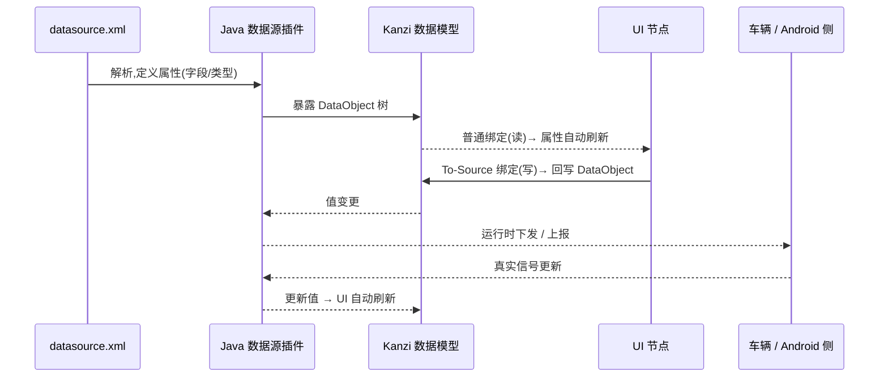
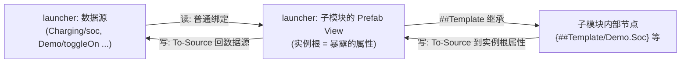

# 数据源:Java 插件 + XML 契约 + 绑定(读/写)

UI 与业务数据通过 **数据源(Data Source)** 解耦。本工程的数据源由 **Java 插件** `Shared/Plugins/datasource/DroidDataSourceplugin.jar` 提供,**解析一份 XML** 得到数据结构,UI 通过**绑定**读写。

## 1. 数据流



## 2. XML 契约(关键:这是和插件/Android 的接口)

数据结构由 XML 决定。**真实契约已落地**在**单一来源** [`IVI/assets/datasource.xml`](../IVI/assets/datasource.xml)(设计期与运行期共用一份,已不再有 common/launcher 两份副本):包含 `System / Vehicle / Charging / VehicleControl / Interior / Demo` 六个分组。示例数据供各模块绑定参照,`Demo` 分组专供样板([demo-module.md](demo-module.md))。Studio 里数据源实例的 File 属性必须指向本文件(修正步骤见 [demo-build-all.md](demo-build-all.md) §4.3)。

**解析器支持的结构(依据插件源码 `SaxHandler` / `TypeConverters`)**:
- `type`:`int` / `float` / `bool` / `string` / `list`(大小写不敏感)。
- **无 `type` 的元素 = Object 分组节点,可嵌套**(用于 `Charging`、`Interior` 这类归类)。
- `list` 内部只允许标量列(int/float/bool/string),**不能再嵌套** Object/list。
- 标量文本 = 默认值(占位;解析会**去除空白**,默认字符串勿依赖空格);真值运行时由 Android 侧提供。

契约样式(节选,完整见文件):

```xml
<DroidDataSource>
    <!-- 系统/状态栏 -->
    <System>
        <timeText type="string">08:24</timeText>
        <locale type="string">zh-CN</locale>
        <theme type="string">Day</theme>
    </System>
    <!-- 充电 -->
    <Charging>
        <soc type="float">62.0</soc>
        <socValid type="bool">true</socValid>
        <chargeStatus type="int">1</chargeStatus>   <!-- 0=未知 1=充电 2=完成 3=暂停 4=故障 -->
        <rangeKm type="float">410.0</rangeKm>
    </Charging>
    <!-- 车控 -->
    <VehicleControl>
        <locked type="bool">true</locked>
        <doorFrontLeft type="bool">false</doorFrontLeft>
        <windowFrontLeft type="int">0</windowFrontLeft>  <!-- 0-100 开度 -->
        <headlightOn type="bool">false</headlightOn>
    </VehicleControl>
    <!-- 内饰 -->
    <Interior>
        <ambientOn type="bool">true</ambientOn>
        <ambientColor type="string">#4D8BFFFF</ambientColor>
        <ambientBrightness type="int">70</ambientBrightness>
    </Interior>
</DroidDataSource>
```

> 规则:字段名/类型/枚举值在 **XML、Kanzi 绑定、Android 端**三处必须一致;交付后**只追加、不改名**;关键信号建议带 `<signal>Valid`(bool)表达故障,UI 据此显示故障态,**禁止用默认值掩盖故障**。

支持的 `type`:`string` / `bool` / `float` / `int` / `list`。

## 3. 数据源归属(重要:插件在 launcher)

**现状**:数据源插件在 **launcher** 的 `Library > Kanzi Engine Plugins` 注册,数据源实例也在 **launcher**。
这与 Kanzi 机制一致:**数据源和本地化/主题一样是 Screen 节点级资源**,天然归属含 Screen 的主工程(launcher)。被引用的子工程(car/demo/…)在设计期**看不到**这个数据源。

因此正确做法是:**在 launcher 里绑定数据源,子模块通过"属性"接收数据、通过"属性/消息"回传** —— 见下面 §3.5。

> (可选,较重)若一定要让子模块在**设计期直接绑数据源字段**,需把**插件 + 数据源定义迁到 common**、各工程引用 common 且 Studio 能加载该插件、数据源设 Public;运行时数据上下文仍在 launcher 的 Screen 设置。非当前方案,不推荐先做。

### 3.1 在 launcher 设 Data Context
- 在 launcher 的 **Screen / 根节点** Properties 添加 `Data Context` 指向数据源;launcher 内节点及**运行时挂到其下的子模块**都继承。
- 一个节点只有一个 Data Context;需要多个数据源时在子树上 override。

### 3.2 读(普通绑定,在 launcher)
- launcher 里的节点 `+ Add Binding` → 把属性(如 `Text`)绑定到数据对象;数据变自动刷新。

### 3.3 写(To-Source,在 launcher)
- Binding Editor 把 Mode 设为 `To Source`,Push Target 指向数据对象。以回推真值刷新 UI,失败显式报错。

### 3.4 子模块内部:只依赖自己的"属性"
- 子模块**不直接绑数据源**;它在根 Prefab 上暴露**输入属性**(自定义 Property Type),内部节点绑定到 `{##Template/<NS>.<Prop>}`。
- 给属性设计期默认值 → 子模块可**独立预览**、与数据源解耦。

### 3.5 launcher ↔ 子模块 的数据传递(核心)



**读(数据源 → 子模块):**
1. 子模块根 Prefab 建输入属性,如 `Demo.Soc`(Real)、`Demo.Title`(String)。内部节点绑 `{##Template/Demo.Soc}`。
2. launcher 中挂载子模块的 **Prefab View** 上,把 `Demo.Soc` **普通绑定**到数据源 `Charging/soc`。
3. 运行时:数据源 → Prefab View 属性 → 子模块内部,自动刷新。

**写(子模块 → 数据源):**
- 方案①(属性回写):子模块交互控件(开关/滑块)把值 **To-Source 写到自己的实例根属性**(`##Template/Demo.ToggleOn`);launcher 在该 Prefab View 上再加一条 **To-Source**,把 `Demo.ToggleOn` 推到数据源 `Demo/toggleOn`。
- 方案②(消息):子模块交互时 dispatch 一个 **Message**(带参数);launcher 用 **Message Trigger** 监听 → Action 写数据源。命令式/事件场景更清晰。

> 一句话:**launcher = 数据绑定层(smart),子模块 = 只认自己属性的展示层(dumb)**;数据源与子模块通过 Prefab View 上的属性(和消息)来回传递。

## 4. 常见坑

| 现象 | 原因 | 解决 |
|------|------|------|
| 子模块里绑不到数据源字段 | 数据源在 launcher,子模块设计期看不到 | 子模块暴露属性、绑 `##Template`;launcher 侧把数据源绑到 Prefab View 属性(§3.5) |
| 运行时数据不更新 | 插件/XML 没加载,或字段名不一致 | 校验插件路径、`IVI/assets/datasource.xml` 路径、字段名三方一致 |
| 写不回数据源 | 只做了读绑定 | 用 To-Source(属性回写)或 Message(§3.5 写) |
| 显示成默认值看不出故障 | 没用有效性字段 | 加 `<signal>Valid`,UI 绑定它显示故障态 |
| 子模块预览没数据 | 设计期无数据源 | 给暴露属性设计期默认值,便于独立预览 |

## 5. 相关
- 本地化文案不要直接绑业务数据源,见 [localization-and-theme.md](localization-and-theme.md) 的 DataLayer 方案。
- 数据源与主题/本地化一样,属于需在含 Screen 节点工程可见的资源,跨工程注意可见性。
