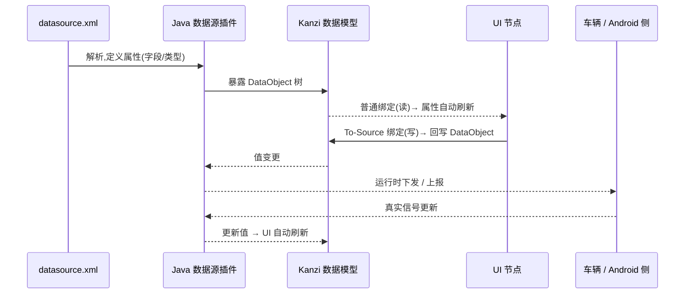

# 数据源:Java 插件 + XML 契约 + 绑定(读/写)

UI 与业务数据通过 **数据源(Data Source)** 解耦。本工程的数据源由 **Java 插件** `plugins/datasource/DroidDataSourceplugin.jar` 提供,**解析一份 XML** 得到数据结构,UI 通过**绑定**读写。

## 1. 数据流



## 2. XML 契约(关键:这是和插件/Android 的接口)

数据结构由 XML 决定。**真实契约已落地**在 [`IVI/common/Binary/datasource.xml`](../IVI/common/Binary/datasource.xml)(运行时副本 `IVI/launcher/Application/bin/datasource.xml` 保持一致):包含 `System / Vehicle / Charging / VehicleControl / Interior / Demo` 分组,并保留 `time / env / Light` 兼容字段。示例数据供各模块绑定参照,`Demo` 分组专供样板([demo-module.md](demo-module.md))。

**解析器支持的结构(依据插件源码 `SaxHandler` / `TypeConverters`)**:
- `type`:`int` / `float` / `bool` / `string` / `list`(大小写不敏感)。
- **无 `type` 的元素 = Object 分组节点,可嵌套**(用于 `Charging`、`Interior` 这类归类)。
- `list` 内部只允许标量列(int/float/bool/string),**不能再嵌套** Object/list。
- 标量文本 = 默认值(占位;解析会**去除空白**,默认字符串勿依赖空格);真值运行时由 Android 侧提供。

契约样式(节选,完整见文件):

```xml
<DroidDataSource>
    <!-- 系统/状态栏 -->
    <System>
        <timeText type="string">08:24</timeText>
        <locale type="string">zh-CN</locale>
        <theme type="string">Day</theme>
    </System>
    <!-- 充电 -->
    <Charging>
        <soc type="float">62.0</soc>
        <socValid type="bool">true</socValid>
        <chargeStatus type="int">1</chargeStatus>   <!-- 0=未知 1=充电 2=完成 3=暂停 4=故障 -->
        <rangeKm type="float">410.0</rangeKm>
    </Charging>
    <!-- 车控 -->
    <VehicleControl>
        <locked type="bool">true</locked>
        <doorFrontLeft type="bool">false</doorFrontLeft>
        <windowFrontLeft type="int">0</windowFrontLeft>  <!-- 0-100 开度 -->
        <headlightOn type="bool">false</headlightOn>
    </VehicleControl>
    <!-- 内饰 -->
    <Interior>
        <ambientOn type="bool">true</ambientOn>
        <ambientColor type="string">#4D8BFFFF</ambientColor>
        <ambientBrightness type="int">70</ambientBrightness>
    </Interior>
</DroidDataSource>
```

> 规则:字段名/类型/枚举值在 **XML、Kanzi 绑定、Android 端**三处必须一致;交付后**只追加、不改名**;关键信号建议带 `<signal>Valid`(bool)表达故障,UI 据此显示故障态,**禁止用默认值掩盖故障**。

支持的 `type`:`string` / `bool` / `float` / `int` / `list`。

## 3. 在 Kanzi Studio 中使用数据源

### 3.1 数据源放哪
- 数据源(插件类型)在 **common** 创建,并设 `Visibility Across Projects = Public`,供各模块引用。
- 插件 jar 路径要让 Studio(预览)和 Android(运行时)都能加载;XML 路径同理。

### 3.2 设置 Data Context
- 在节点(通常是模块根/某容器)Properties 添加 **`Data Context`**,指向数据源;**子节点自动继承**。
- 一个节点只有一个 Data Context;若同时要多个数据源,在子树上分别 override。

### 3.3 读(普通绑定)
- 选中节点 → Properties → `+ Add Binding` → 把属性(如 `Text`)绑定到 Data Context 下的数据对象。
- 数据变 → 绑定自动刷新(这就是"监听",无需额外节点)。

### 3.4 写(To-Source 绑定)
- 在 Binding Editor 把 **Mode 设为 `To Source`**,Push Target 指向数据对象。
- 例:车窗滑块的值 → To-Source 写回 `VehicleControl.windowFrontLeft`;插件监听变更后下发车辆。
- 写操作以**回推的真实状态**刷新 UI;失败走显式错误,不静默。

## 4. 常见坑

| 现象 | 原因 | 解决 |
|------|------|------|
| 绑定不到字段/下拉看不到 | 数据源未 Public,或模块未引用 common | common 里数据源设 Public,模块加 Project Reference |
| 运行时数据不更新 | 插件/XML 没被加载,或字段名不一致 | 校验插件路径、XML 路径、字段名三方一致 |
| 显示成默认值看不出故障 | 没用有效性字段 | 加 `<signal>Valid`,UI 绑定它显示故障态 |
| 预览里数据是死的 | 设计期靠 XML 的 stub 值 | 在 XML 填合理 stub 便于预览 |

## 5. 相关
- 本地化文案不要直接绑业务数据源,见 [localization-and-theme.md](localization-and-theme.md) 的 DataLayer 方案。
- 数据源与主题/本地化一样,属于需在含 Screen 节点工程可见的资源,跨工程注意可见性。
