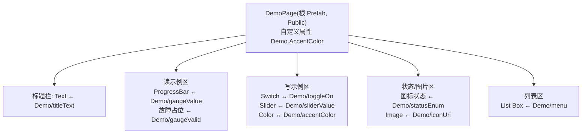

# demo 模块 — 样板与开发示例大全

`IVI/demo/` 是**样板模块**:把所有常用开发手法各做一个最小示例,其它模块照着它开发即可覆盖完整功能。每个示例都绑定到数据源契约里的字段(见单一来源 [`assets/datasource.xml`](../assets/datasource.xml) 的 `Demo` 分组)。

> 说明:`demo.kzproj` 的节点/绑定/Prefab/状态机需在 **Kanzi Studio 里搭建**(工程文件是工具序列化格式,不手改)。本文是**精确到步骤的蓝图**,照着在 Studio 里建即可;每个示例标注了绑定字段与做法。

## 示例清单(demo 需全部包含)

| # | 示例 | 绑定字段(`Demo/…`) | 手法 |
|---|------|--------------------|------|
| 1 | 引用 common | — | Project Reference + Public |
| 2 | 设 Data Context | — | 数据上下文继承 |
| 3 | 读:文本 | `titleText` (string) | 普通绑定 → Text |
| 4 | 读:数值/进度 | `gaugeValue` (float) | 普通绑定 → ProgressBar/表盘 |
| 5 | 故障态 | `gaugeValid` (bool) | Valid=false → 显示故障 |
| 6 | 写:开关 | `toggleOn` (bool) | To-Source 绑定 |
| 7 | 写:滑块 | `sliderValue` (int) | To-Source 绑定 |
| 8 | 写:颜色 | `accentColor` (string) | 颜色字符串读写 |
| 9 | 枚举→状态 | `statusEnum` (int) | 状态机/图标切换 |
| 10 | 图片 URI | `iconUri` (string) | Image ← 数据源 URI |
| 11 | 列表 | `menu` (list: index/title/icon) | List Box + 数据模板 |
| 12 | 本地化 | — | 文案走本地化(DataLayer) |
| 13 | 主题 | — | 样式引用 token,日/夜切换 |
| 14 | Prefab 控制 | `Demo.AccentColor`(自定义属性) | `##Template` 暴露 |
| 15 | 组件复用 | — | 用 common 的 Button/Card/Slider/ListItem |
| 16 | 导航/挂载 | — | launcher 用 Prefab View 挂 demo |
| 17 | 动画 | — | Animation Timeline / State Manager |

## demo 页面结构(建议)

---

## 逐项步骤(在 Kanzi Studio 中)

### 1. 新建/打开 demo 并引用 common
- `Library > Project References > Add Existing Project` → `IVI/common/common.kzproj`。
- 之后可用 common 的字体、主题 token、通用组件、数据源(它们在 common 已 Public)。

### 2. 设 Data Context
- 选 `DemoPage` 根节点 → Properties 加 `Data Context` → 指向数据源(`kzb://common/.../DroidDataSource`)。子节点自动继承。
- 需要重新导入数据源结构:数据源变更后,在 Studio 里 **Update / 重新导入** 该数据源,才会出现新的 `Demo/*`、`Charging/*` 等字段。

### 3. 读:文本
- Text Block → Properties → `+ Add Binding` → `Text` 绑定到 `Demo/titleText`。

### 4. 读:数值 / 进度
- 用 common 的 ProgressBar(或表盘 Prefab)→ 绑定其 `Value` 到 `Demo/gaugeValue`。
- (float 62.0 → 进度 62%,注意量程换算)

### 5. 故障态
- 绑定 `Demo/gaugeValid`:当为 `false` 时,用 State Manager/绑定表达式让数值区显示"--"并置 `Color/Error`(见主题),**不要用默认值伪装正常**。

### 6. 写:开关(To-Source)
- 用 common 的 ToggleSwitch。给它的 `IsChecked`:
  - 读:普通绑定 ← `Demo/toggleOn`;
  - 写:再加一条 **To-Source** 绑定,Push Target = `Demo/toggleOn`。
- 运行时插件监听该字段变更并下发。

### 7. 写:滑块(To-Source)
- 用 common 的 Slider,`Value` 读 ← `Demo/sliderValue`,并加 To-Source 写回 `Demo/sliderValue`(int 0-100)。

### 8. 写:颜色字符串
- 一个色块/取色控件,把颜色属性与 `Demo/accentColor`(`#RRGGBBAA` 字符串)做读写;写用 To-Source。
- 字符串↔颜色的转换按项目约定(绑定表达式或转换)。

### 9. 枚举 → 状态/图标切换
- 用 `Demo/statusEnum`(int)驱动 State Manager 或图标:0/1/2/3/4 各对应一个视觉状态(参考 `Charging.chargeStatus` 语义)。

### 10. 图片 URI → Image
- Image 节点的图片来源绑定到 `Demo/iconUri`(字符串 URI);插件的内容加载器(ContentProtocol)按 URI 取图。
- 给一个占位图,URI 无效时显示占位。

### 11. 列表 → List Box
- 用 common 的 List Box + item 模板 Prefab(含 Text ← `title`、Image ← `icon`)。
- `Items Source` 绑定到 `Demo/menu`(list,列:index/title/icon);列表数据运行时由 Android 侧填充。

### 12. 本地化(中/英)
- demo 里所有文案**不要硬编码**;走本地化。跨工程用 [localization-and-theme.md](localization-and-theme.md) 的 **DataLayer 方案**:launcher 解析 → DataLayer 字符串 → demo 只读普通 string。
- demo 内演示至少 1 个文案随语言切换。

### 13. 主题(日/夜)
- demo 所有颜色/字号/圆角引用 common 的**主题 token**(Resource Dictionary),不写死。
- 演示切换 `Theme_Day`/`Theme_Night` 时 demo 外观随之变化。

### 14. Prefab 控制(`##Template`)
- 在 `DemoPage` 根节点加自定义属性 `Demo.AccentColor`(Property Types 里建)。
- demo 内部要用强调色的节点,绑定到 `{##Template/Demo.AccentColor}`。
- 这样 launcher 在挂载 demo 的 Prefab View 上设 `Demo.AccentColor` 即可从外部控制 demo 主色(参考现有 `CarControl.CarColor` 做法)。

### 15. 组件复用
- demo 里的按钮/卡片/开关/滑块/列表项**全部用 common 的组件 Prefab 实例**,不在 demo 里另造控件——示范"组件复用"。

### 16. 在 launcher 挂载 + 导航
- launcher `Library > Project References` 引用 `IVI/demo/demo.kzproj`。
- 内容区建 **Prefab View**,`Prefab Template` = `kzb://demo/Prefabs/Pages/DemoPage`;在 Prefab View 上设 `Demo.AccentColor` 演示外部控制。
- 接入 launcher 导航/状态机,可从桌面进入 demo。

### 17. 动画
- 用 **Animation Timeline / State Manager** 做 1 个过渡示例(如进入 demo 页的淡入、开关切换的位移)。
- 遵循规范:单页动效 ≤ 3,时长档位(100/200ms),曲线明确(linear/smooth),见 [conventions.md](conventions.md) 第 12 节。

---

## 交付自检(demo 作为样板)
- [ ] 覆盖上表 1–17 全部示例,各有一处最小实现
- [ ] 全部绑定到 `Demo/*` 真实字段;写操作用 To-Source
- [ ] 无硬编码文字(本地化)、无硬编码样式(token)
- [ ] `DemoPage` 为 Public,暴露 `Demo.AccentColor` 供外部控制
- [ ] 已在 launcher 挂载并可导航进入
- [ ] 能独立导出 `demo.kzb`(运行时先加载 `common.kzb`)

## 数据源改动后必做
契约已收敛为**单一来源** `assets/datasource.xml`(不再有 common/launcher 两份),含 `System/Vehicle/Charging/VehicleControl/Interior/Demo` 分组,保留 `time/env/Light`。数据源结构变更后,**在 Studio 里重新导入/更新数据源**才会出现新字段;旧的 `*_Test` 绑定若有需改到新字段。
