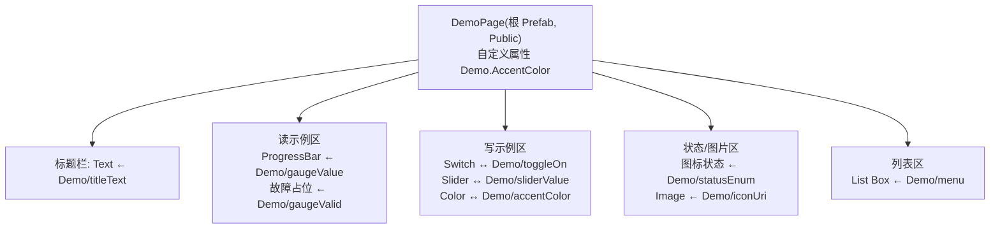

# demo 模块 — 样板与开发示例大全

`IVI/demo/` 是**样板模块**:把所有常用开发手法各做一个最小示例,其它模块照着它开发即可覆盖完整功能。每个示例都绑定到数据源契约里的字段(见单一来源 [`assets/datasource.xml`](../assets/datasource.xml) 的 `Demo` 分组)。

> ⭐ **逐步操作以 [demo-build-all.md](demo-build-all.md)(v2)为准**(已按 Kanzi Studio 3.9.15 官方文档逐步核实)。v2 把 demo 扩为双子页:子页 A=本文的数据绑定八卡;子页 B 新增八张进阶卡(触发器与动作、关键帧动画+属性插值、长按手势、Scroll View 滚动、Data Trigger、2D 特效、3D 视口、Prefab 动态热切换),对应下表示例 18–25。

> 说明:`demo.kzproj` 的节点/绑定/Prefab/状态机需在 **Kanzi Studio 里搭建**(工程文件是工具序列化格式,不手改)。本文是**蓝图 + 布局 + 连线表**;**逐步的 Studio 点选操作**见 [Kanzi Studio 操作手册](kanzi-studio-guide.md)。
>
> **数据源在 launcher**(插件在 launcher 注册),demo 作为子模块设计期看不到数据源。所以下文 `Demo/xxx` 指**数据源字段**,"绑数据源"这步在 **launcher 侧**做;**demo 内部**只绑自己暴露的输入属性 `Demo.Xxx`(`##Template`)。机制见 [data-source.md §3.5](data-source.md),连线见本文末「launcher 连线对照表」。

## 页面示意图

> 一张横屏(车机)Demo 页:顶栏(时间/标题/主题·语言切换)+ 一组卡片,每张卡片演示一种手法。示意图仅表意,实际以 Kanzi 内用 common 组件搭建为准。

## 整页布局(区域 → 展示 → 字段)

| 区域 | 展示内容 | 关联字段 / 手法 |
|------|----------|-----------------|
| 顶栏左 | 时间 `08:24` | `System/timeText`(读) |
| 顶栏中 | 标题 "DEMO" | `Demo.Title` ← `Demo/titleText`(读) |
| 顶栏右 | 日/夜、中/EN 切换 | 主题 token 切换 + 本地化 locale 切换 |
| 卡片1 读·进度 | 环形进度 62% | `Demo.GaugeValue` ← `Demo/gaugeValue`;`Demo/gaugeValid`=false→"--" |
| 卡片2 读·文本 | 文本行 | `Demo.Title`(读) |
| 卡片3 写·开关 | 开关(ON) | `Demo.ToggleOn` ↔ `Demo/toggleOn`(写) |
| 卡片4 写·滑块 | 滑块 30% | `Demo.SliderValue` ↔ `Demo/sliderValue`(写) |
| 卡片5 写·颜色 | 色块 + 调色 | `Demo.AccentColor` ↔ `Demo/accentColor`(写) |
| 卡片6 枚举·状态 | 状态图标 | `Demo.StatusEnum` ← `Demo/statusEnum`(状态机) |
| 卡片7 图片 | 图片缩略 | `Demo.IconUri` ← `Demo/iconUri`(URI 取图) |
| 卡片8 列表 | 3 行列表 | `Demo/menu`(list)→ List Box |

## 示例清单(demo 需全部包含)

| # | 示例 | 绑定字段(`Demo/…`) | 手法 |
|---|------|--------------------|------|
| 1 | 引用 common | — | Project Reference + Public |
| 2 | 暴露输入属性 | `Demo.*` | `##Template` + launcher 连线 |
| 3 | 读:文本 | `titleText` (string) | 普通绑定 → Text |
| 4 | 读:数值/进度 | `gaugeValue` (float) | 普通绑定 → ProgressBar/表盘 |
| 5 | 故障态 | `gaugeValid` (bool) | Valid=false → 显示故障 |
| 6 | 写:开关 | `toggleOn` (bool) | To-Source 绑定 |
| 7 | 写:滑块 | `sliderValue` (int) | To-Source 绑定 |
| 8 | 写:颜色 | `accentColor` (string) | 颜色字符串读写 |
| 9 | 枚举→状态 | `statusEnum` (int) | 状态机/图标切换 |
| 10 | 图片 URI | `iconUri` (string) | Image ← 数据源 URI |
| 11 | 列表 | `menu` (list: index/title/icon) | List Box + 数据模板 |
| 12 | 本地化 | — | 文案走本地化(DataLayer) |
| 13 | 主题 | — | 样式引用 token,日/夜切换 |
| 14 | Prefab 控制 | `Demo.AccentColor`(自定义属性) | `##Template` 暴露 |
| 15 | 组件复用 | — | 用 common 的 Button/Card/Slider/ListItem |
| 16 | 导航/挂载 | — | launcher 用 Prefab View 挂 demo |
| 17 | 动画 | — | Animation Timeline / State Manager |
| 18 | 触发器与动作 | — | Button: Click → Set Property / Write Log;消息冒泡 + Set Message Handled |
| 19 | 关键帧动画 + 平滑插值 | — | Animation Clip + Animation Player(Start 动作);Property Target Interpolator |
| 20 | 手势(长按) | — | Long-Press Manipulator 触发器(非 Button 节点) |
| 21 | 滚动 | — | Scroll View 2D + Scroll Started/Finished 触发器 |
| 22 | 数据触发器 | `statusEnum` | Data Trigger + Apply Property Action(与绑定法对照) |
| 23 | 2D 特效 | — | Shadow / Blur Effect 2D、Effect Stack 2D 毛玻璃 |
| 24 | 3D 视口 | — | Viewport 2D + Scene + Camera + Light + 变换绑定 |
| 25 | 动态换 Prefab | — | Prefab View 监听 Prefab Template,热切换内容 |

> 18–25 的逐步配方见 [demo-build-all.md](demo-build-all.md) §10;子页切换本身即 State Manager + 转场示例(§6.3)。

## demo 页面结构(建议)

---

## 逐项步骤(在 Kanzi Studio 中)

> **重要:数据源在 launcher(插件在 launcher 注册),demo 作为子模块设计期看不到数据源。**
> 因此下表/下文里写的 `Demo/xxx` 指**数据源字段**,实际"绑定到数据源"这一步在 **launcher 侧**完成;**demo 内部**只绑定到自己暴露的输入属性 `Demo.Xxx`(`##Template`)。数据传递机制见 [data-source.md §3.5](data-source.md)。

### 1. 新建/打开 demo 并引用 common
- `Library > Project References > Add Existing Project` → `IVI/common/common.kzproj`。
- 之后可用 common 的字体、主题 token、通用组件(它们在 common 已 Public)。**数据源不在 common,不在此列。**

### 2. 暴露输入属性(替代"在 demo 里设数据源 Data Context")
- 在 `DemoPage` 根 Prefab 用 **Property Types** 建一组输入属性:`Demo.Title`(String)、`Demo.GaugeValue`(Real)、`Demo.ToggleOn`(Bool)、`Demo.SliderValue`(Int)、`Demo.AccentColor`(Color/String)、`Demo.StatusEnum`(Int)、`Demo.IconUri`(String) 等。
- demo 内部节点绑定到 `{##Template/Demo.Xxx}`;给属性**设计期默认值**便于独立预览。
- **launcher 侧**:在挂载 demo 的 Prefab View 上,把这些属性绑定到数据源对应字段(读用普通绑定、写用 To-Source),见 [data-source.md §3.5](data-source.md)。
- 数据源结构变更后,在 launcher 里 **Update / 重新导入**数据源,才会出现新的 `Demo/*`、`Charging/*` 字段。

### 3. 读:文本
- Text Block → Properties → `+ Add Binding` → `Text` 绑定到 `Demo/titleText`。

### 4. 读:数值 / 进度
- 用 common 的 ProgressBar(或表盘 Prefab)→ 绑定其 `Value` 到 `Demo/gaugeValue`。
- (float 62.0 → 进度 62%,注意量程换算)

### 5. 故障态
- 绑定 `Demo/gaugeValid`:当为 `false` 时,用 State Manager/绑定表达式让数值区显示"--"并置 `Color/Error`(见主题),**不要用默认值伪装正常**。

### 6. 写:开关(To-Source)
- 用 common 的 ToggleSwitch。给它的 `IsChecked`:
  - 读:普通绑定 ← `Demo/toggleOn`;
  - 写:再加一条 **To-Source** 绑定,Push Target = `Demo/toggleOn`。
- 运行时插件监听该字段变更并下发。

### 7. 写:滑块(To-Source)
- 用 common 的 Slider,`Value` 读 ← `Demo/sliderValue`,并加 To-Source 写回 `Demo/sliderValue`(int 0-100)。

### 8. 写:颜色字符串
- 一个色块/取色控件,把颜色属性与 `Demo/accentColor`(`#RRGGBBAA` 字符串)做读写;写用 To-Source。
- 字符串↔颜色的转换按项目约定(绑定表达式或转换)。

### 9. 枚举 → 状态/图标切换
- 用 `Demo/statusEnum`(int)驱动 State Manager 或图标:0/1/2/3/4 各对应一个视觉状态(参考 `Charging.chargeStatus` 语义)。

### 10. 图片 URI → Image
- Image 节点的图片来源绑定到 `Demo/iconUri`(字符串 URI);插件的内容加载器(ContentProtocol)按 URI 取图。
- 给一个占位图,URI 无效时显示占位。

### 11. 列表 → List Box
- 用 common 的 List Box + item 模板 Prefab(含 Text ← `title`、Image ← `icon`)。
- `Items Source` 绑定到 `Demo/menu`(list,列:index/title/icon);列表数据运行时由 Android 侧填充。

### 12. 本地化(中/英)
- demo 里所有文案**不要硬编码**;走本地化。跨工程用 [localization-and-theme.md](localization-and-theme.md) 的 **DataLayer 方案**:launcher 解析 → DataLayer 字符串 → demo 只读普通 string。
- demo 内演示至少 1 个文案随语言切换。

### 13. 主题(日/夜)
- demo 所有颜色/字号/圆角引用 common 的**主题 token**(Resource Dictionary),不写死。
- 演示切换 `Theme_Day`/`Theme_Night` 时 demo 外观随之变化。

### 14. Prefab 控制(`##Template`)
- 在 `DemoPage` 根节点加自定义属性 `Demo.AccentColor`(Property Types 里建)。
- demo 内部要用强调色的节点,绑定到 `{##Template/Demo.AccentColor}`。
- 这样 launcher 在挂载 demo 的 Prefab View 上设 `Demo.AccentColor` 即可从外部控制 demo 主色(参考现有 `CarControl.CarColor` 做法)。

### 15. 组件复用
- demo 里的按钮/卡片/开关/滑块/列表项**全部用 common 的组件 Prefab 实例**,不在 demo 里另造控件——示范"组件复用"。

### 16. 在 launcher 挂载 + 导航
- launcher `Library > Project References` 引用 `IVI/demo/demo.kzproj`。
- 内容区建 **Prefab View**,`Prefab Template` = `kzb://demo/Prefabs/Pages/DemoPage`;在 Prefab View 上设 `Demo.AccentColor` 演示外部控制。
- 接入 launcher 导航/状态机,可从桌面进入 demo。

### 17. 动画
- 用 **Animation Timeline / State Manager** 做 1 个过渡示例(如进入 demo 页的淡入、开关切换的位移)。
- 遵循规范:单页动效 ≤ 3,时长档位(100/200ms),曲线明确(linear/smooth),见 [conventions.md](conventions.md) 第 12 节。

---

## launcher 连线对照表(核心)

在 launcher 里挂载 demo 的那个 **Prefab View** 节点上,逐条建立"属性 ↔ 数据源字段"绑定。demo 内部只认左列的**输入属性**(`##Template`),launcher 负责把它们接到右列的数据源字段。

| demo 暴露属性(##Template) | 类型 | 方向 | 数据源字段 | Binding 模式(launcher) |
|-----|------|------|-----------|-----------|
| `Demo.Title` | String | 读 | `Demo/titleText` | 普通(One way) |
| `Demo.GaugeValue` | Real | 读 | `Demo/gaugeValue` | 普通 |
| `Demo.GaugeValid` | Bool | 读 | `Demo/gaugeValid` | 普通 |
| `Demo.ToggleOn` | Bool | 读写 | `Demo/toggleOn` | 读:普通;写:To-Source |
| `Demo.SliderValue` | Int | 读写 | `Demo/sliderValue` | 读:普通;写:To-Source |
| `Demo.AccentColor` | Color/String | 读写 | `Demo/accentColor` | 读:普通;写:To-Source |
| `Demo.StatusEnum` | Int | 读 | `Demo/statusEnum` | 普通 |
| `Demo.IconUri` | String | 读 | `Demo/iconUri` | 普通 |

- **读**:在 Prefab View 上给该属性 `+ Add Binding`,Expression 指向数据源字段。
- **写**:再加一条 `Mode=To Source` 的绑定,Push Target 指向数据源字段(demo 内部控件已把值 To-Source 写到实例根属性)。
- **列表 `Demo/menu`**:launcher 侧把 List Box 的 `Items Source` 绑到 `Demo/menu`;若列表在 demo 内,则由 launcher 把 items 通过数据上下文传入(列表建议直接放 launcher 侧或用消息驱动)。

> 小结:**demo 只暴露属性、绑 `##Template`;launcher 照这张表把属性接到数据源。** 换真实模块时,把 `Demo.*` 换成模块自己的属性、右列换成对应真实信号即可。

## 交付自检(demo 作为样板)
- [ ] 覆盖上表 1–17 全部示例,各有一处最小实现
- [ ] 全部绑定到 `Demo/*` 真实字段;写操作用 To-Source
- [ ] 无硬编码文字(本地化)、无硬编码样式(token)
- [ ] `DemoPage` 为 Public,暴露 `Demo.AccentColor` 供外部控制
- [ ] 已在 launcher 挂载并可导航进入
- [ ] 能独立导出 `demo.kzb`(运行时先加载 `common.kzb`)

## 数据源改动后必做
契约已收敛为**单一来源** `assets/datasource.xml`(不再有 common/launcher 两份),含 `System/Vehicle/Charging/VehicleControl/Interior/Demo` 六个分组。数据源结构变更后,**在 Studio 的 Data Sources 面板里更新数据源**(见 demo-build-all.md §4.3)才会出现新字段;旧绑定若指向被调整的字段需同步修改。
