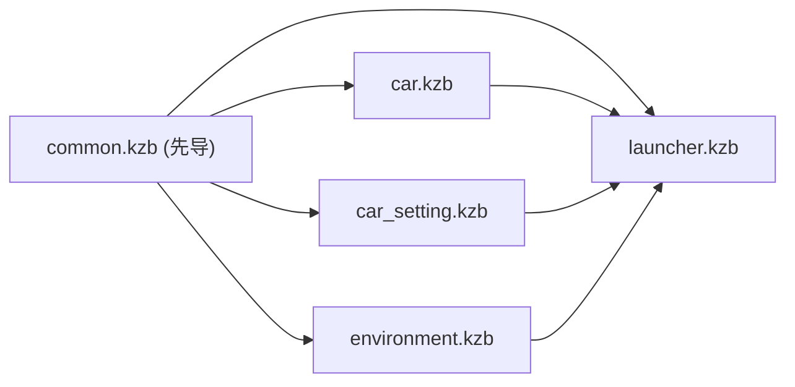

# 导出 kzb 与依赖关系

## 1. 导出粒度
- 每个 `.kzproj` 导出一个 kzb:`common.kzb` / `launcher.kzb` / `car.kzb` / `car_setting.kzb` / `environment.kzb`。
- common 的资源被各工程以 `kzb://common/...` 引用,**不复制进各模块**(单一来源、体积小)。

## 2. 依赖与导出顺序



- **被依赖者先导**:先 `common`,再各模块,最后/同时 `launcher`(launcher 组合各模块)。
- 所有上层基于**同一版本 common** 导出;common 改了就重导依赖它的 kzb。

## 3. 运行时加载约束(交给 Android 侧)

| kzb | 依赖 | 加载约束 |
|-----|------|----------|
| `common.kzb` | 无 | 必须最先加载;有上层在用时不可卸载 |
| `car/car_setting/environment.kzb` | `common.kzb` | 加载模块前确保 common 已加载 |
| `launcher.kzb` | `common` + 各模块 | 作为入口组合 |

## 4. 导出设置
- **纹理压缩**:按目标 GPU 选 ASTC/ETC2,别打包原始 PNG。
- **图集**:小图标合并图集,降 draw call。
- **裁剪未引用资源**;**命名稳定**(根 Prefab / 数据字段交付后冻结)。
- 数据源 XML / 插件 jar 路径对 Studio 与 Android 两端都要可达。

## 5. 命令行导出(建议纳入 CI)
> 命令行工具名随 Kanzi 版本(如 `KanziStudioConsole`),以本团队版本为准;下方为流程示意。

```text
导出 common → 导出 car / car_setting / environment / launcher(基于同版本 common)
   → 校验:数据字段 ⇔ datasource.xml 一致
   → 产物归档 + 更新依赖清单 → 交付 Android
```

## 6. 产物与版本控制
- kzb 是构建产物,**不入库**(`.gitignore` 已忽略 `*.kzb` / `*.kzb.cfg` / `*.kzb.txt`)。
- 若需把某些 kzb 作为对 Android 的交付物入库,单独评估并在 `.gitignore` 放行。
- 大源资源(png/glb/otf/MeshData…)走 **Git LFS**(`.gitattributes`)。

## 7. Visual Studio 本地运行（Windows）

C++ 入口 `launcher.cpp` 在启动时加载:

```cpp
configuration.binaryName = "launcher.kzb.cfg";
```

CMake 将 VS **工作目录**设为仓库根 **`assets/`**（与 `launcher.kzproj` 的 `BinaryExportDirectory` 一致）。该目录下**必须**有 Studio 导出的 `launcher.kzb.cfg`（及其中列出的各 `.kzb`）。

| 现象 | 原因 | 处理 |
|------|------|------|
| `Cannot open ... launcher.kzb.cfg` | 未 Export KZB，或导出目录与 VS 工作目录不一致 | Studio 导出到 `assets/`；重新 CMake 生成 VS 方案 |
| 能开 cfg 但黑屏/缺资源 | 依赖 kzb 未导出或未放在同目录 | 按 §2 顺序导出到同一 `assets/` |
| DLL 找不到 | Kanzi Engine 核心运行时未复制到 exe 目录 | 重新 CMake 生成 |
| `Could not find ./kzjava.jar` | `plugins/java/kzjava.jar` 缺失 | 见 [`plugins/README.md`](../plugins/README.md)，放入后重新编译 |
| `Failed to load plugin 'kzjvm.dll'` | `plugins/jvm/.../kzjvm.dll` 缺失或 JDK 未配置 | 同上 |

> **不必**使用 `IVI/launcher/Application/bin`：只要 **导出目录 = 进程工作目录** 即可。本工程选用 `assets/` 是为与 `datasource.xml` 同目录。

详见 [`assets/README.md`](../assets/README.md)。
