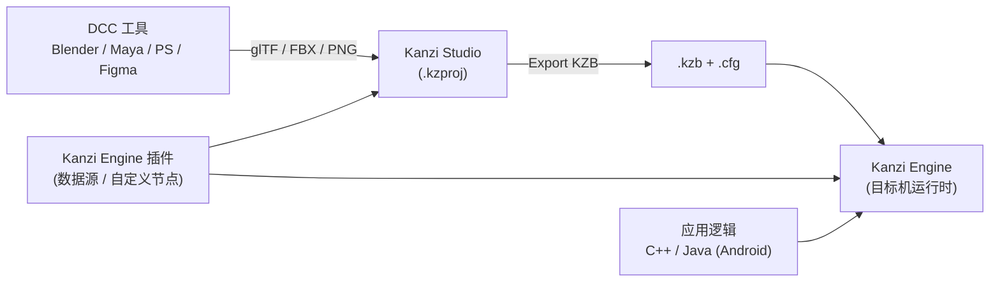
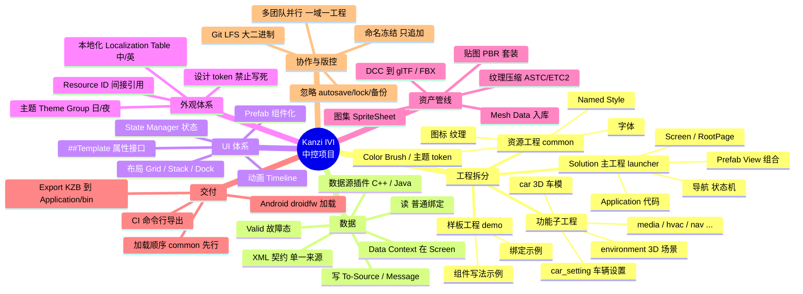
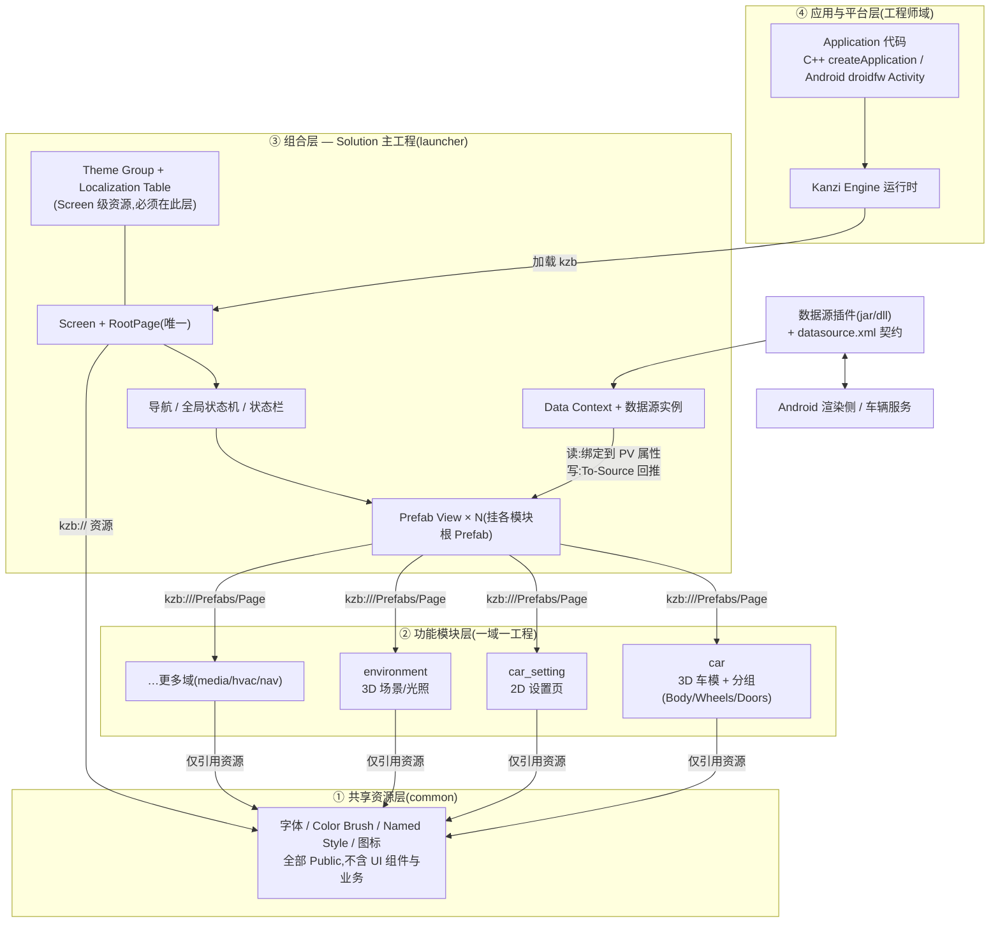
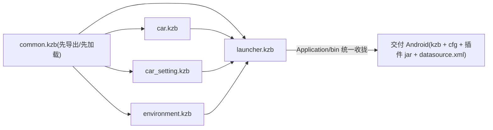
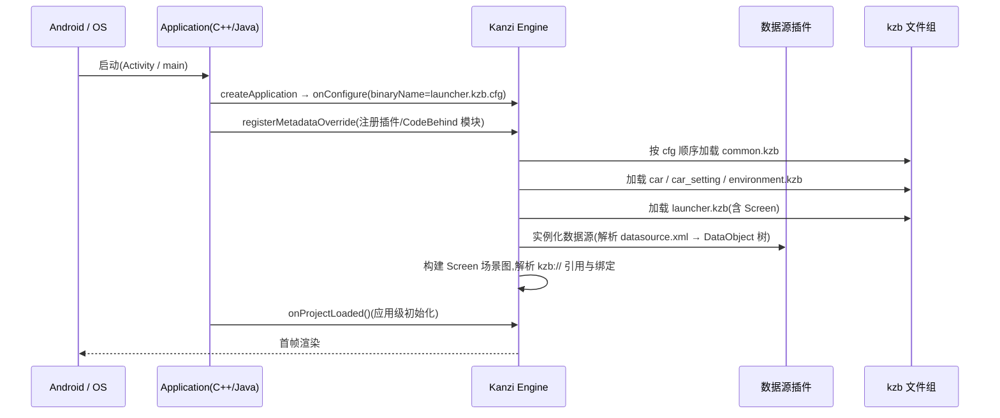
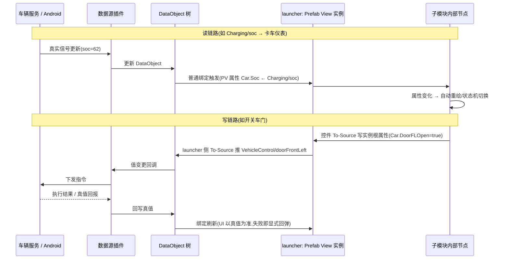
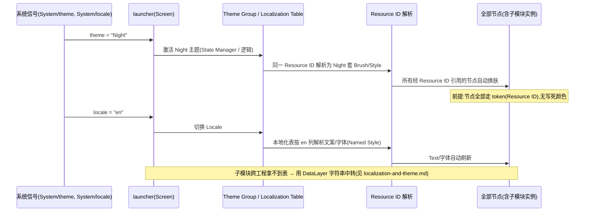
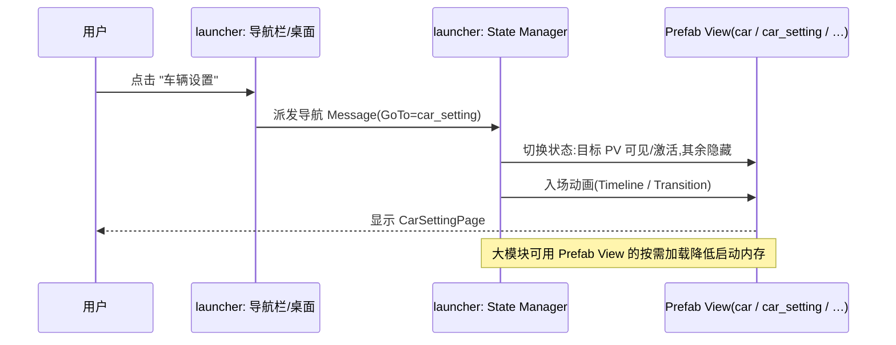

# Kanzi Studio 中控(IVI)项目标准架构设计

> 依据 **Kanzi 3.9.15 官方文档**([docs.kanzi.com/3.9.15](https://docs.kanzi.com/3.9.15/en/overview.html))与本仓库现状总结。
> 内容:Kanzi 基础概念 → 官方标准工程结构 → 多工程 Solution 架构 → 标准中控项目架构(脑暴图 / 架构图 / 时序图)→ 标准文件结构 → 本项目对照与差距分析。
>
> 官方关键出处:
> - [Overview](https://docs.kanzi.com/3.9.15/en/overview.html)(Studio / Engine 分工)
> - [Projects](https://docs.kanzi.com/3.9.15/en/working-with/projects/projects.html)(工程目录组成)
> - [Creating a project](https://docs.kanzi.com/3.9.15/en/working-with/projects/creating-a-new-project.html)(模板与 `Tool_project` / `Application` 结构)
> - [Combining Kanzi Studio projects into a Kanzi application](https://docs.kanzi.com/3.9.15/en/working-with/projects/using-assets-from-another-project.html)(Solution / 资源工程 / Public / 主题与本地化约束)
> - [Data sources](https://docs.kanzi.com/3.9.15/en/working-with/data-sources/data-sources.html)(数据源插件)

---

## 1. Kanzi 是什么:三个核心构件

| 构件 | 角色 | 产物/形态 |
|------|------|-----------|
| **Kanzi Studio** | 设计与集成工具:导入 2D/3D 内容、搭 UI、做绑定/状态机/动画,导出二进制 | `.kzproj` 工程 → 导出 **`.kzb`** |
| **Kanzi Engine** | 运行时:加载 kzb 渲染执行,跨平台(Android/QNX/Linux/Win) | C++ / Java(droidfw)API |
| **Kanzi Engine 插件** | 扩展 Engine:自定义节点、**数据源(Data Source)** 等 | C++ DLL / Java `.jar` |

一句话:**Studio 产出 kzb(内容+交互逻辑),Engine 在目标机上加载 kzb 运行,应用逻辑与数据经 Engine API / 插件注入**。UI(设计师域)与业务逻辑(工程师域)由此解耦。



---

## 2. 官方标准:单个工程的目录结构

用 **Application / Application with data source plugin / Android application** 等模板创建工程时,Kanzi 生成两个根目录(官方 [Creating a project](https://docs.kanzi.com/3.9.15/en/working-with/projects/creating-a-new-project.html)):

```text
<ProjectName>/
├── Tool_project/                  # Kanzi Studio 工程(设计域)
│   ├── <ProjectName>.kzproj       # 工程文件(XML;只通过 Studio 修改)
│   ├── <ProjectName>.kzproj_1..10 # 自动滚动备份(不入库)
│   ├── <ProjectName>.lock         # 会话锁(不入库)
│   ├── Images/                    # 资源文件目录:加进目录即自动进 Library
│   ├── Fonts/
│   ├── Shaders/
│   ├── 3D Assets/                 # 导入的 glTF/FBX 源
│   ├── Mesh Data/                 # 导入 mesh 的顶点/索引数据(仅 Studio 用,必须入库)
│   ├── Animations/                # 动画关键帧数据(仅 Studio 用,必须入库)
│   ├── Source Assets/             # 原始设计源文件(PSD/Blend 等;不导出进 kzb)
│   └── Restore Points/            # 手动还原点(不入库)
└── Application/                   # Kanzi Engine 应用(工程师域)
    ├── bin/                       # kzb 导出目标 + application.cfg(运行时读取)
    ├── src/                       # C++ 应用源码(executable / plugin)
    ├── configs/platforms/         # 各平台构建配置(android_gradle / win 等)
    ├── CMakeLists.txt
    └── generate_cmake_vs20xx_solution.bat
```

要点:

- **`Tool_project` 是设计域、`Application` 是工程域**,一一对应。
- `Mesh Data/`、`Animations/` 只有 Studio 用,但**必须提交版本库**(官方明确提醒)。
- `Source Assets/` 用来存 PSD/Blender 源文件,Studio 不处理、不导出,仅为"源文件跟着工程走"。
- 导出 kzb 默认落到 `Application/bin`,与 `.cfg` 一起交给运行时。
- **纯 Studio 工程模板(Kanzi Studio project)可以只有 `.kzproj` + 资源目录,没有 `Application/`** —— 这正是多工程方案中子工程的标准形态。

---

## 3. 官方标准:多工程组合(Kanzi Studio Solution)

中控/IVI 这类大型应用,官方推荐**多工程组合成一个应用**(官方 [Combining Kanzi Studio projects](https://docs.kanzi.com/3.9.15/en/working-with/projects/using-assets-from-another-project.html)),目的:多团队并行、按域拆分、共享资源、复用 kzb。

### 3.1 三种工程角色

| 角色 | 官方定义 | 模板 | 数量 |
|------|----------|------|------|
| **Solution 工程(主工程)** | 持有 **Screen**、组合其它工程、承载应用代码构建;kzb 统一导出到它的 `Application/bin` | Application(+plugin)/ Android application | 1 个 |
| **资源工程(Resource Project)** | 只放跨工程共享的资源(字体/Brush/Style/图片);官方专有模板 **New Resource Project**(只含 Screen、无默认纹理) | New Resource Project | 1 个(可多) |
| **功能子工程** | 各业务域一个;**Kanzi Studio project 模板**(无 Application/),逻辑统一放 Solution 的 VS/Gradle 工程 | Kanzi Studio project | N 个 |

### 3.2 官方组合规则(必须遵守)

1. **引用**:`Library > Project References > Existing Project`(或 Existing .kzb)。引用顺序 = 运行时 kzb 加载顺序。
2. **可见性**:被引内容默认不可见,需逐项 **Make Public**(`Visibility Across Projects = Public`)或整工程 `Resource Visibility Across Projects = Public`。
3. **子工程放到 Solution 工程根目录下**(官方原文:即使工程间有层级,也平铺放 solution 根目录)。
4. **跨工程控制 Prefab**:在子工程 Prefab 根节点上建自定义属性 + **`##Template` 绑定**(Studio 一键生成),主工程在 Prefab View 实例上赋值/绑定 —— 这是官方的"对外属性接口"模式。
5. **主题(Theme Group)与本地化表(Localization Table)在 Screen 节点解析**,必须放在(或合并进)含 Screen 的主工程;跨 kzb 共享需 Rightware 专用插件。
6. 外部文件(如数据源 XML)要放到 Solution 的 **Preview Working Directory**(默认 `Application/bin`)可达的路径。
7. 所有工程用**同一 Color Workflow**;导出时 Solution 会把所有引用工程的 kzb 收拢到 `Application/bin`。

### 3.3 数据源(官方 [Data sources](https://docs.kanzi.com/3.9.15/en/working-with/data-sources/data-sources.html))

- 数据源由 **Kanzi Engine 插件**定义(C++ DLL 或 Android Java 插件),在 Studio `Library > Kanzi Engine Plugins` 导入并启用。
- Studio 里在 **Data Sources** 窗口创建实例,在 Screen/根节点设 **Data Context**,节点属性绑定数据对象;写回用 **To Source 绑定**。
- 数据源实例与 Data Context 属于**主工程(含 Screen)**;子工程设计期看不到 → 子工程用 §3.2-4 的 `##Template` 属性接口接数据(本仓库 [data-source.md](data-source.md) §3.5 即此模式)。

---

## 4. 标准中控(IVI)项目架构设计

### 4.1 脑暴图(一个标准 Kanzi 中控项目要考虑的全部维度)



### 4.2 静态架构图(分层)

一个标准 Kanzi 中控项目在逻辑上分四层,依赖**自上而下、单向无环**:



铁律(与官方规则对应):

1. **只有主工程有 Screen 参与运行时**;子工程的 Screen 仅用于独立预览。
2. **模块之间禁止互相引用**;共享内容一律下沉 common。
3. **主题/本地化/数据源都是 Screen 级资源**,放主工程;子模块经 `##Template` 属性接口消费。
4. **launcher = smart(数据绑定/导航),模块 = dumb(只认自己暴露的属性)**。

### 4.3 标准文件结构(仓库级)

结合官方结构与中控工程实践,一个标准仓库长这样(`<repo>` 平铺所有工程,Solution 主工程带完整 `Tool_project + Application`,子工程精简):

```text
<repo>/
├── README.md
├── .gitattributes                  # 大二进制走 Git LFS(png/dds/otf/glb/jar/MeshData)
├── .gitignore                      # autosave / *.kzproj_N / .lock / Temp / 缓存 / *.kzb
│
├── launcher/                       # ★ Solution 主工程(唯一含 Application)
│   ├── Tool_project/
│   │   ├── launcher.kzproj         # Screen/RootPage、导航、Prefab View、数据源实例、主题、本地化表
│   │   └── Images/ ...
│   └── Application/
│       ├── bin/                    # 全部 kzb 的统一导出与运行目录(含 application.cfg)
│       ├── src/                    # C++ 入口(createApplication)
│       ├── configs/platforms/      # android_gradle / win 等平台工程
│       └── CMakeLists.txt
│
├── common/                         # ★ 资源工程(官方 New Resource Project 形态)
│   ├── common.kzproj               # 仅:Fonts / Brush / Theme token / Named Style / 图标(全 Public)
│   └── Fonts/  Images/
│
├── car/                            # ★ 功能子工程(Kanzi Studio project 模板,无 Application)
│   ├── car.kzproj                  # 根 Prefab: Prefabs/Pages/CarPage(Public)
│   ├── 3D Assets/                  # glb/fbx 源
│   ├── Mesh Data/                  # 导入网格数据(入库!)
│   ├── Animations/                 # 动画关键帧(入库!)
│   ├── Images/  Shaders/
│   └── Source Assets/              # Blender 源文件等(不导出)
├── car_setting/
│   └── car_setting.kzproj  + Images/ ...
├── environment/
│   └── environment.kzproj  + Images/ MeshData/ Shaders/ ...
├── demo/                           # (可选)样板工程:组件/绑定写法示例,非运行时依赖
│   └── demo.kzproj
│
├── assets/
│   └── datasource.xml              # ★ 数据契约单一来源(Studio 与运行时共用)
├── plugins/
│   └── datasource/                 # 数据源插件(jar/dll + sources)
├── scripts/                        # 辅助脚本(模型分组/迁移/CI 导出)
└── docs/                           # 架构、规范、操作手册、PlantUML 图源
```

命名与引用规范(详见 [conventions.md](conventions.md)):

- 工程名与 kzb 名**全小写**且冻结:`launcher` / `common` / `car` …(kzb URL 形如 `kzb://car/Prefabs/Pages/CarPage`)。
- 每个模块**一个稳定的根 Prefab** `<Domain>Page`,是模块对外的唯一入口。
- 自定义属性 `<Namespace>.<Prop>`(如 `Car.DoorFrontLeftOpen`)。
- 数据字段与 `datasource.xml`、Android 端逐字一致,关键信号带 `<signal>Valid`。

### 4.4 kzb 产物与依赖



- Solution 导出时,Studio 会把**所有引用工程的 kzb**导到主工程 `Application/bin`(可用 Project Properties 的 Binary Export Directory 改)。
- Project References 的**顺序 = 运行时加载顺序**:common 必须排最前。
- kzb 是构建产物,不入库;CI 用命令行导出(KanziStudioConsole 类工具)统一产出。

---

## 5. 时序图

### 5.1 应用启动与 kzb 加载



### 5.2 数据读写(数据源 ↔ launcher ↔ 子模块)



### 5.3 主题(日/夜)与语言(中/英)切换



### 5.4 页面导航(launcher 组合层)



### 5.5 设计 → 构建 → 交付管线

```mermaid
sequenceDiagram
    participant Design as 设计(Figma / Blender)
    participant Sub as 子工程(car 等)
    participant Common as common
    participant L as launcher(Solution)
    participant CI as CI / 导出
    participant And as Android 渲染侧

    Design->>Sub: 交付 glTF/切图(命名按规范,变换冻结)
    Sub->>Common: 引用资源 token(不写死样式)
    Sub->>Sub: 搭 <Domain>Page + expose 属性 + Make Public
    Sub->>L: launcher 加 Project Reference,Prefab View 挂载
    L->>L: PV 属性 ↔ 数据源绑定(读/To-Source)
    CI->>Common: 导出 common.kzb
    CI->>Sub: 导出各模块 kzb(基于同版本 common)
    CI->>L: 导出 launcher.kzb → 收拢到 Application/bin
    CI->>And: 交付 kzb + cfg + 插件 jar + datasource.xml
    And->>And: droidfw 加载(先 common)→ 接真实数据
```

---

## 6. 本项目对照:符合项与差距

### 6.1 已符合标准的部分

| 项 | 现状 | 对应官方规则 |
|----|------|--------------|
| 多工程拆分 | `launcher`(Solution)+ `common`(资源)+ `car`/`car_setting`/`environment`(功能)+ `demo`(样板) | Solution 结构 §3.1 |
| 引用方向 | 已核实 kzproj:launcher → 5 个工程;各子工程 → 仅 common;common 无引用 → **单向无环** ✅ | 引用规则 |
| 只有 launcher 带 `Application/`(C++ 入口 + android_gradle) | ✅ 子工程精简为 `.kzproj` + 资源目录 | 子工程用 Studio-only 模板 |
| 数据源归属 | 插件(`DroidDataSourceplugin.jar`)与数据源实例都在 launcher;子模块走 `##Template` 属性接口 | 数据源/Screen 级资源 §3.3 |
| 数据契约 | `assets/datasource.xml` 单一来源,类型/Valid 约定清晰 | Data sources |
| 主题/本地化 | 表在 launcher(Screen 级),common 出 token + Named Style,DataLayer 中转文案 | §3.2-5 |
| 版控 | LFS 管大二进制;忽略 autosave/`kzproj_N`/lock/Temp/kzb 产物 | 官方 Version control 指引 |

### 6.2 与标准的差距(按影响排序)

| # | 差距 | 标准做法 | 建议 |
|---|------|----------|------|
| 1 | **`Car.kzproj` 首字母大写**,与其余小写工程(`demo.kzproj` 等)及自家"全小写"铁律不一致;kzb URL 已是 `kzb://car/...`,大小写敏感平台有隐患 | 工程名/文件名全小写且冻结 | 在 Studio 中重命名为 `car.kzproj` 并同步 launcher 引用(高优先) |
| 2 | **car 内部网格命名是 Blender 默认名**(`Circle.076`、`Cube.161`、`Vert.125`…),Prefab 目录里还有 `4x2_1027_shadow_update_3 1` 这类含空格的导入名 | 3D 部件按 `内外饰_部件_功能_材质` 命名,层级=节点层级 | 分组工作(Body/Wheels/Doors)已在做;后续在 Blender 侧按规范改名再导入 |
| 3 | **launcher 设计期引用了 demo**(kzproj 中存在 `..\..\demo\demo.kzproj` 引用) | demo 仅文档级样板,不应进入 Solution 运行时引用链 | demo 暂停期间从 launcher 的 Project References 移除,或导出时确认不打包 `demo.kzb` |
| 4 | **environment 里有 `Prefabs/test` 等临时命名**;`car_setting` 尚未接入 launcher 导航 | 根 Prefab 统一 `<Domain>Page` 且 Public;每模块必须可被组合 | 清理 test 类节点;按 [add-new-module.md](add-new-module.md) 补 `CarSettingPage` 挂载 |
| 5 | **common 非官方 Resource Project 形态**(仍带 DefaultBackground/DefaultCubeMap 等默认资源) | `New Resource Project` 只含 Screen、无默认资源,更干净 | 可接受;新资源工程建议用官方模板,存量用 Clean up 清理未引用资源 |
| 6 | **子工程与 launcher 平级放在 `IVI/` 下**,而官方建议子工程放 Solution 工程根目录内 | 官方:子项目平铺在 solution 项目根目录 | 现状可用(相对路径引用正常);若重构目录,注意 kzproj 引用与 CI 路径同步 |
| 7 | **无 CI 命令行导出**;导出顺序靠人工遵守 | Solution 一键导出全部 kzb 到 `Application/bin`;CI 固化 | 增加导出脚本/流水线:common → 模块 → launcher,校验字段与 `datasource.xml` 一致 |
| 8 | **缺 `Source Assets/`、`Animations/` 目录约定**(car 只有 `3D Assets/` 和 `MeshData/`) | 官方目录:Mesh Data/Animations 必须入库,Source Assets 存 DCC 源文件 | 在各 3D 模块补目录约定;`.gitattributes` 已覆盖 MeshData 的 LFS |

> 差距 1–4 属"改名/清理引用"类,`.kzproj` 是 XML 但官方要求只经 Studio 修改,建议全部在 Kanzi Studio 内操作后提交。

---

## 7. 一页总结

**标准 Kanzi Studio 中控项目 = 「1 个 Solution 主工程 + 1 个资源工程 + N 个功能子工程 + 1 个数据源插件 + 1 份数据契约」**:

- **结构**:只有主工程有 `Application/`(代码与 kzb 收拢点);子工程是纯 Studio 工程,一域一工程,平铺放置;共享资源全部下沉资源工程并 Public。
- **依赖**:`launcher → 模块 → common`,单向无环,模块互不引用;Screen/主题/本地化/数据源只在主工程。
- **接口**:模块对外只有两样东西 —— **一个 Public 的 `<Domain>Page` 根 Prefab** + **一组 `##Template` 暴露属性**;数据经主工程的 Prefab View 绑定进出(读=普通绑定,写=To-Source/Message)。
- **外观**:颜色/字体/文案全部走 token(Resource ID)与本地化键,禁止写死,从而日/夜、中/英切换零改动。
- **交付**:每工程一个 kzb,common 先导先加载,产物统一落 `Application/bin`,连同 cfg、插件、datasource.xml 交给 Android(droidfw)加载。

本仓库的骨架(工程拆分、引用方向、数据源归属、契约单一来源、版控策略)已与官方标准一致;主要欠账是**命名规范化(Car.kzproj、Blender 默认网格名)、demo 引用清理、car_setting 接入与 CI 导出固化**,见 §6.2 清单。
