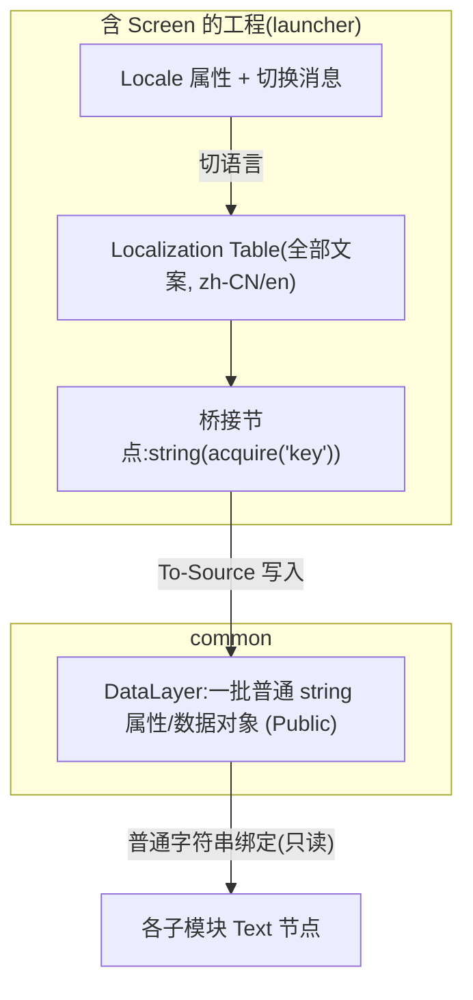

# 本地化(中/英)与主题(日/夜)

> **落地架构方案**(结合官方 3.9.15 机制与工程现有资产的完整设计:数据驱动切换链路、分阶段改造清单、验证点)见 [architecture/localization-theme-design.md](architecture/localization-theme-design.md)。本文保留为原则速查。

Kanzi 的**本地化表**和**主题组**都在 **Screen 节点**层解析,属于"应用级"资源,**不能像普通 Public 资源那样跨工程实时共享**。所以多工程下需要专门的处理方式。

## 1. 本地化(中文 / 英文)

### 1.1 推荐方案:集中解析 + DataLayer 中转 + 子模块只读普通 string

让子模块**不碰本地化表**,只读一个普通字符串属性,从而绕开跨工程限制。



- **表放含 Screen 的工程(launcher)**;`common` 放 **DataLayer**(纯 string,Public)。
- launcher 用 `string(acquire("key"))` 解析当前语言文字,再 **To-Source** 写到 DataLayer 的字符串属性。
- 子模块只把 `Text` 绑定到 DataLayer 的字符串属性 → **对语言零感知**,切语言时自动刷新。

### 1.2 单一工程内(若某模块独立预览需要本地化)
- 可在该工程内直接建本地化表;或用 **PO 文件作为译文单一来源**,各含 Screen 的工程 `Import` 同一份 PO,保证 key 一致。

### 1.3 规则
- 所有文案走本地化键,**禁止在 TextBlock 硬编码文字**。
- key 命名:`<模块>.<语义>`,如 `charging.title`、`common.ok`。
- 英文比中文长,文本容器用自适应布局,避免截断。
- 字体:中文用 `kzb://common/Fonts/NotoSansCJKsc`(已在 common),按用字子集化控制体积。

## 2. 主题(日 / 夜)

### 2.1 用 Resource Dictionary 做 token
- 颜色/字体/尺寸/动效时长全部 **token 化**,放 Resource Dictionary;Prefab 只引用 token,**不写死样式**。
- 至少两套:`Theme_Day` / `Theme_Night`;切换主题=切换激活的 Dictionary,不动任何 Prefab。

### 2.2 跨工程注意
- 主题组同样在 Screen 节点解析。共享策略与本地化类似:
  - 把"已解析的颜色/尺寸值"当普通资源/属性下发,或
  - 在含 Screen 的工程统一定义/合并主题。
- 不随主题切换的**静态资源**(固定字体、图标纹理)可作为普通 Public 资源由 common 共享。

### 2.3 token 命名
```text
Color/Background   Color/Surface   Color/Accent
Color/TextPrimary  Color/TextSecondary  Color/Divider
Color/Success      Color/Warning   Color/Error
Font/Title  Font/Body  Font/Caption
Size/RadiusM  Size/SpacingM  Motion/DurationNormal
```
- 故障/不可用统一用 `Color/Error` + `common.unavailable`,**不要用默认值伪装正常**。

## 3. 反模式(严禁)
- TextBlock 直接填中文/英文字面量。
- 节点上写死十六进制颜色 / 固定字号。
- 子模块直接引用 launcher 的本地化表(跨工程不可靠);应走 DataLayer 字符串。
- 漏译回退成 key 名或空串而不报缺陷。
