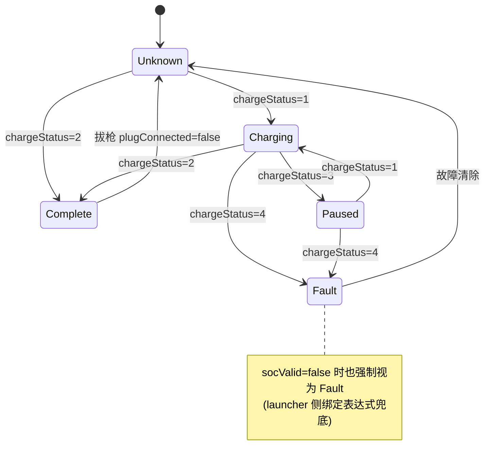

# 状态机规格:充电状态(SM_ChargingStatus)

> 清单产物 5/9。通用机制与 Studio 操作步骤见 [README.md](README.md) §3,此处只写本状态机的设计与连线。

## 1. 概要

| 项 | 值 |
|----|-----|
| 名称 | `SM_ChargingStatus` |
| 归属 | `car_setting`(充电卡片/页面根节点) |
| State Group | `SG_Status`(Controller Property 驱动) |
| 控制属性 | `Charging.Status`(Int,暴露属性;设计期默认 `0`) |
| 驱动字段 | `Charging/chargeStatus`(0未知 1充电 2完成 3暂停 4故障) |
| 辅助字段 | `Charging/socValid`、`Charging/plugConnected`、`Charging/soc`、`Charging/chargePower`、`Charging/remainingMinutes` |

## 2. 状态图

> 状态机本身是**值→状态映射**(无迁移限制),上图的箭头表达的是业务上可能发生的信号序列;任意值跳变都能正确落态。

## 3. 状态表(值 → 外观快照)

| State | 映射值 | 外观快照(记录的属性) |
|-------|--------|------------------------|
| `Unknown` | 0 | 图标灰色插头;文案 `charging.unknown`;进度环隐藏 |
| `Charging` | 1 | 图标绿色闪电 + 呼吸动画;显示 `soc`% / `chargePower`kW / 剩余 `remainingMinutes`;进度环 `Color/Success` |
| `Complete` | 2 | 图标绿色对勾;文案 `charging.complete`;进度环满格常亮 |
| `Paused` | 3 | 图标黄色暂停;文案 `charging.paused`;进度环 `Color/Warning`,动画停 |
| `Fault` | 4 | 图标红色叹号;文案 `charging.fault`;进度环 `Color/Error`;数值区显示 `--` |

过渡:相邻切换 200ms smooth;进入 `Fault` **Immediate**(告警不等动画)。

## 4. launcher 连线对照表

| Prefab View 属性 | 绑定 | 方向 |
|------------------|------|------|
| `Charging.Status` | `{DataContext.Charging.chargeStatus}`,socValid=false 时表达式强制 `4` | 读 |
| `Charging.Soc` | `{DataContext.Charging.soc}` | 读 |
| `Charging.Power` | `{DataContext.Charging.chargePower}` | 读 |
| `Charging.RemainMin` | `{DataContext.Charging.remainingMinutes}` | 读 |
| `Charging.TargetSoc` | `{DataContext.Charging.targetSoc}` | 读 + **To-Source**(滑块可设置目标电量) |

## 5. 验收清单

- [ ] Preview 中手动把 `Charging.Status` 从 0→4 逐值切换,五态外观正确
- [ ] `socValid=false` 时落 Fault,数值显示 `--`(不显示旧值)
- [ ] 进入 Fault 无过渡动画;其余过渡 200ms
- [ ] 文案全部走本地化 key(`charging.*`),颜色走 `Color/*` token
- [ ] 目标电量滑块 To-Source 回写 `targetSoc` 成功(演示:改后 XML 侧值变化)
