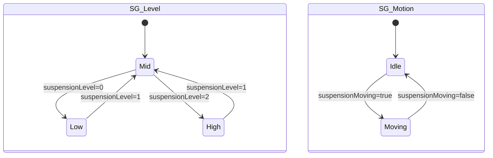

# 状态机规格:底盘控制(SM_Chassis)— 悬架高度

> 清单产物 7/9。本状态机演示**多 State Group**:同一 State Manager 里"高度"与"执行中"两个关注面正交组合,避免状态爆炸。

## 1. 概要

| 项 | 值 |
|----|-----|
| 名称 | `SM_Chassis` |
| 归属 | `car_setting`(底盘控制卡片根节点;车身姿态联动在 `car` 模块) |
| State Group | `SG_Level`(高度)+ `SG_Motion`(执行中)|
| 控制属性 | `Chassis.Level`(Int,默认 1);`Chassis.Moving`(Bool,默认 false) |
| 驱动字段 | `Chassis/suspensionLevel`(0低 1标准 2高)、`Chassis/suspensionMoving`、`Chassis/chassisValid` |
| 写回 | 用户选目标高度 → To-Source 回写 `suspensionLevel` |

## 2. 状态图(两个正交 Group)

组合语义:`Moving` 叠加在任意高度态上(升降执行中,目标高度已选定但未到位)。

## 3. 状态表

### SG_Level(记录:车身示意图位置、文字、档位指示)

| State | 映射值 | 外观快照 |
|-------|--------|----------|
| `Low` | 0 | 车身示意下沉;文案 `chassis.low`;低位档点亮 |
| `Mid` | 1 | 标准位置;文案 `chassis.standard`;中位档点亮 |
| `High` | 2 | 车身抬升;文案 `chassis.high`;高位档点亮 |

### SG_Motion(记录:动画开关、按钮可用性)

| State | 映射值 | 外观快照 |
|-------|--------|----------|
| `Idle` | false | 高度按钮可点;无进行中动画 |
| `Moving` | true | 升降箭头动画播放;高度按钮禁点(防连发);文案追加 `chassis.adjusting` |

过渡:`SG_Level` 之间 300ms smooth(车身示意平滑升降);`SG_Motion` Immediate。

## 4. 与 3D 车模联动(可选增强)

`car` 模块根 Prefab 暴露 `Car.SuspensionLevel`(Int);launcher 把同一字段 `Chassis/suspensionLevel` 也绑到 car 的 Prefab View 上,car 内部用同构状态机/绑定驱动 `Body` 节点 Y 位移 —— **同一契约字段,双工程各自消费,互不依赖**。

## 5. launcher 连线对照表

| Prefab View 属性 | 绑定 | 方向 |
|------------------|------|------|
| `Chassis.Level` | `{DataContext.Chassis.suspensionLevel}` | 读 + **To-Source** |
| `Chassis.Moving` | `{DataContext.Chassis.suspensionMoving}` | 读 |
| `Chassis.Valid` | `{DataContext.Chassis.chassisValid}` | 读(Data Trigger 置灰) |
| (car)`Car.SuspensionLevel` | `{DataContext.Chassis.suspensionLevel}` | 读 |

## 6. 验收清单

- [ ] 三档高度切换外观正确,车身示意 300ms 平滑移动
- [ ] `suspensionMoving=true` 期间按钮禁点、动画播放;结束自动恢复
- [ ] Moving 与任意高度态可叠加(如 Mid+Moving → High+Idle)
- [ ] `chassisValid=false` 整卡置灰
- [ ] 用户点"高" → To-Source 写 2 → 模拟 Moving true/false 序列 → 最终 High+Idle(端到端演示脚本)
