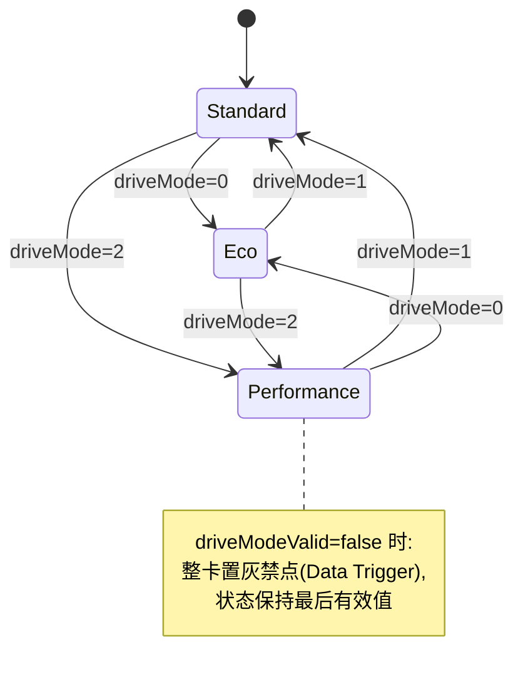
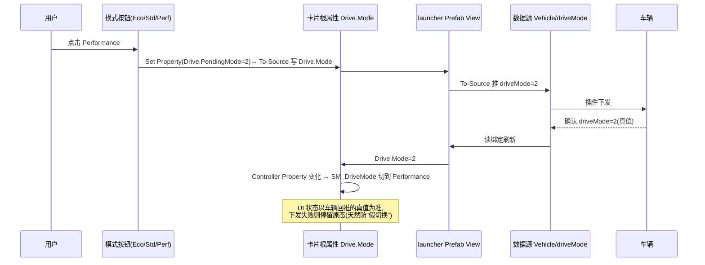

# 状态机规格:驾驶模式(SM_DriveMode)— 经济 / 标准 / 性能

> 清单产物 6/9。通用机制见 [README.md](README.md);本状态机同时演示**双向**:既被数据驱动,也由用户点击切换并回写。

## 1. 概要

| 项 | 值 |
|----|-----|
| 名称 | `SM_DriveMode` |
| 归属 | `car_setting`(驾驶模式控制卡片根节点) |
| State Group | `SG_Mode`(Controller Property 驱动) |
| 控制属性 | `Drive.Mode`(Int,暴露属性;设计期默认 `1`) |
| 驱动字段 | `Vehicle/driveMode`(0经济 1标准 2性能)+ `Vehicle/driveModeValid` |
| 写回 | 用户点选模式按钮 → To-Source 回写 `Vehicle/driveMode` |

## 2. 状态图

## 3. 状态表

| State | 映射值 | 外观快照 |
|-------|--------|----------|
| `Eco` | 0 | 主题色 `Color/Success`(绿);叶子图标;背景氛围渐变绿;文案 `drive.eco`;能耗提示可见 |
| `Standard` | 1 | 主题色 `Color/Accent`(蓝);默认图标;文案 `drive.standard` |
| `Performance` | 2 | 主题色 `Color/Error` 系(红);赛道图标;背景氛围渐变红;文案 `drive.performance`;仪表放大 |

过渡:全部 300ms smooth(模式切换是"仪式感"场景,允许较长动画);同时联动 3D 氛围可后续绑 `car` 模块暴露属性。

## 4. 交互回路(读写闭环)

> 注意:按钮**不要**用 Go to State 直接切状态(会被控制属性覆盖,也会造成假状态);一律走"写数据→真值回推→状态机自动切"。

## 5. launcher 连线对照表

| Prefab View 属性 | 绑定 | 方向 |
|------------------|------|------|
| `Drive.Mode` | `{DataContext.Vehicle.driveMode}` | 读 + **To-Source** |
| `Drive.Valid` | `{DataContext.Vehicle.driveModeValid}` | 读(Data Trigger 置灰用) |

## 6. 验收清单

- [ ] 改数据源 `driveMode` 三态外观正确、动画 300ms
- [ ] 点击按钮后:XML 值先变,状态随真值回推才切(演示时可断开回推示范"防假切换")
- [ ] `driveModeValid=false`:卡片置灰、按钮禁点、状态不跳
- [ ] 三个按钮当前态高亮与状态一致(同一控制属性驱动,无二套逻辑)
