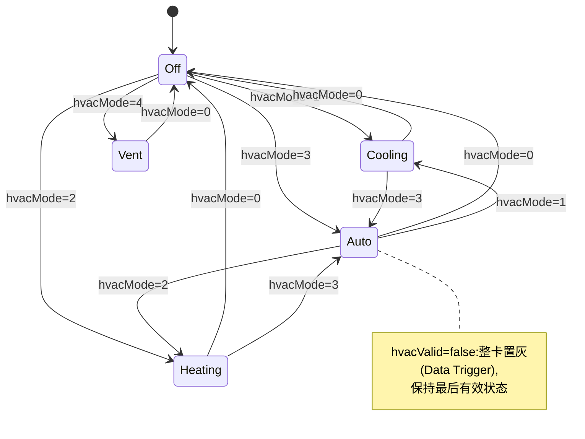
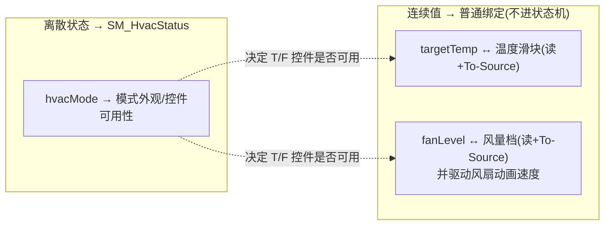

# 状态机规格:空调状态(SM_HvacStatus)

> 清单产物 9/9。空调卡片的模式状态机 + 温度/风量的连续值绑定配合(演示"状态机管离散态、绑定管连续值"的分工)。

## 1. 概要

| 项 | 值 |
|----|-----|
| 名称 | `SM_HvacStatus` |
| 归属 | `car_setting`(空调卡片根节点) |
| State Group | `SG_Mode`(Controller Property 驱动) |
| 控制属性 | `Hvac.Mode`(Int,暴露属性;默认 0) |
| 驱动字段 | `Hvac/hvacMode`(0关闭 1制冷 2制热 3自动 4仅通风)+ `Hvac/hvacValid` |
| 连续值(不进状态机) | `Hvac/targetTemp`(16.0–30.0℃,步进 0.5)、`Hvac/fanLevel`(0–5) |
| 写回 | 模式按钮、温度滑块、风量档位 → To-Source |

## 2. 状态图

## 3. 状态表

| State | 映射值 | 外观快照 |
|-------|--------|----------|
| `Off` | 0 | 全卡低亮度;仅电源图标可点;温度/风量控件禁用置灰;文案 `hvac.off` |
| `Cooling` | 1 | 主色 `Color/Accent`(冷蓝);雪花图标;冷风粒子/流动动画;温度/风量可调 |
| `Heating` | 2 | 主色暖橙(主题 token `Color/Warning` 系);太阳图标;暖风动画;可调 |
| `Auto` | 3 | 主色 `Color/Success`;AUTO 徽标;风量控件隐藏(自动);温度可调 |
| `Vent` | 4 | 中性色;风扇图标 + 旋转动画(转速可绑 `fanLevel`);温度控件禁用,仅风量可调 |

过渡:Off↔任意 200ms;工作态之间 100ms;`hvacValid=false` 不切态(置灰盖在外面)。

## 4. 分工:状态机 vs 绑定

> 规矩:**枚举/布尔进状态机;数值走绑定**。状态只负责"这个数值控件现在可不可用、长什么样"。

## 5. launcher 连线对照表

| Prefab View 属性 | 绑定 | 方向 |
|------------------|------|------|
| `Hvac.Mode` | `{DataContext.Hvac.hvacMode}` | 读 + **To-Source**(模式按钮) |
| `Hvac.TargetTemp` | `{DataContext.Hvac.targetTemp}` | 读 + **To-Source**(滑块) |
| `Hvac.FanLevel` | `{DataContext.Hvac.fanLevel}` | 读 + **To-Source**(档位) |
| `Hvac.Valid` | `{DataContext.Hvac.hvacValid}` | 读(Data Trigger 置灰) |

## 6. 验收清单

- [ ] 五态外观与控件可用性矩阵正确(Off 禁调温、Auto 隐藏风量、Vent 禁调温)
- [ ] 温度/风量改动 To-Source 回写成功;真值回推后 UI 一致
- [ ] 风扇旋转速度随 `fanLevel` 连续变化(演示"绑定驱动动画")
- [ ] `hvacValid=false` 整卡置灰且状态不跳
- [ ] 模式切换动画:Off↔工作态 200ms,工作态间 100ms
