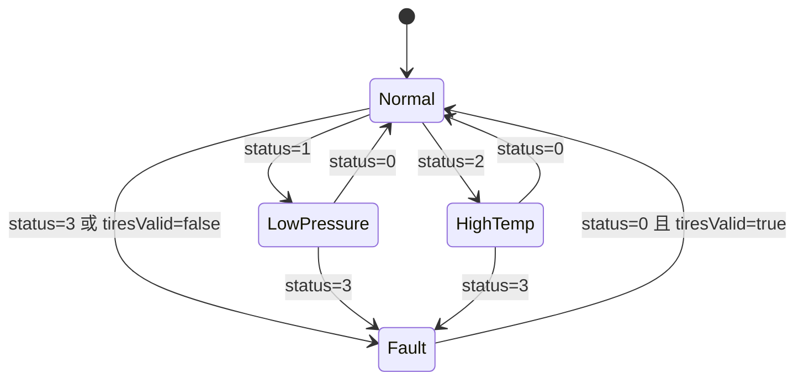
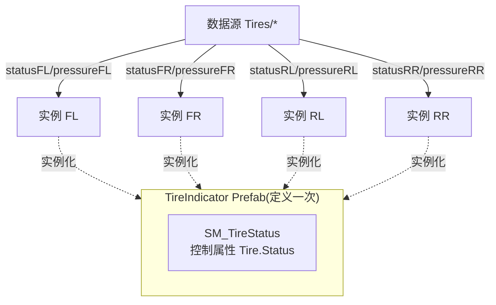

# 状态机规格:轮胎状态(SM_TireStatus × 4)

> 清单产物 8/9。本状态机演示**同构复用**:一个状态机定义在轮胎指示 Prefab 里,四个实例(FL/FR/RL/RR)各自绑一路数据。

## 1. 概要

| 项 | 值 |
|----|-----|
| 名称 | `SM_TireStatus`(定义在 `TireIndicator` Prefab 内) |
| 归属 | `car` 模块(围绕 3D 车模的四角指示),`car_setting` 可复用同一 Prefab 做 2D 胎压页 |
| State Group | `SG_TireState`(Controller Property 驱动) |
| 控制属性 | `Tire.Status`(Int,暴露属性;默认 0);另暴露 `Tire.Pressure`(Real)显示数值 |
| 驱动字段 | `Tires/statusFL..RR`(0正常 1低压 2高温 3故障/无信号)、`Tires/pressureFL..RR`、`Tires/tiresValid` |

## 2. 状态图

## 3. 状态表

| State | 映射值 | 外观快照 |
|-------|--------|----------|
| `Normal` | 0 | 轮廓 `Color/TextSecondary`;胎压数值正常显示(bar,1 位小数) |
| `LowPressure` | 1 | 轮廓+数值 `Color/Warning`(黄);低压图标;缓慢闪烁动画(1Hz) |
| `HighTemp` | 2 | 轮廓+数值 `Color/Warning`;高温图标;闪烁 |
| `Fault` | 3 | 轮廓 `Color/Error`(红);数值显示 `--`;故障图标常亮 |

过渡:全部 **Immediate**(告警类信息不做过渡动画);闪烁用状态内动画(进入状态才播放,离开自动停)。

## 4. 四实例复用结构

- 车模页四个实例摆放位置与 `Wheel_FL..RR` 3D 分组([car-model-grouping.md](../car-model-grouping.md))对应。
- 汇总告警(任一非 Normal 时页面顶部出黄条)由页面级 Data Trigger 做:条件 `max(statusFL..RR) > 0`(绑定表达式聚合),不再建第五个状态机。

## 5. launcher 连线对照表(car 模块 Prefab View 上)

| Prefab View 属性 | 绑定 | 方向 |
|------------------|------|------|
| `Car.TireStatusFL` → 实例 FL `Tire.Status` | `{DataContext.Tires.statusFL}`,tiresValid=false 时表达式强制 `3` | 读 |
| `Car.TirePressureFL` → 实例 FL `Tire.Pressure` | `{DataContext.Tires.pressureFL}` | 读 |
| (FR/RL/RR 同构 ×3) | 对应字段 | 读 |

> 模块根一次性暴露 8 个属性(4×status + 4×pressure),内部再分发到四个实例 —— 保持"launcher 只看根 Prefab 接口"的规矩。

## 6. 验收清单

- [ ] 单轮改 `statusFL=1`:仅左前轮变黄闪烁,其余三轮不动
- [ ] `tiresValid=false`:四轮全部落 Fault、数值 `--`
- [ ] 状态切换无过渡动画;闪烁只在告警态播放
- [ ] 四实例来自同一 Prefab(改 Prefab 一处,四处生效)
- [ ] 页面顶部汇总黄条随任一轮告警出现/消失(Data Trigger 自动回滚)
